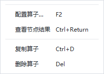

# Designer 快捷键接入与运行保护验证（2026-10-06）

本轮修复运行中 Delete／Backspace 和旧编辑命令可绕过右键菜单保护的问题，并接入常用项目、流程、页面和结果查看快捷键。专项、相关回归、仅含本轮改动的候选和原生 Windows Qt 路径通过。完整 CI 为 FAIL：2992 passed、1 failed、8 skipped、28 subtests passed；唯一失败是本轮起始工作区已有的窄工具栏问题。保留运行页面性能与 Qt 稳定性结论。

## 1. 代码身份与范围

- 分支：`agent/runtime-workflow-architecture-v1`。
- 起始 HEAD：`ef27c3a68344228e0943f05e1adc4e9c44323e5a`。
- 第一批：`4a6331d827cadf335851dd4ba56e5796d720c7ce`，运行保护和复现测试。
- 第二批：`4ed4330064727e25c8dff8dc265b3eb0376aa4ba`，统一 QAction 适配、常用快捷键和键盘测试。
- 进入本轮时已有 233 个修改或未跟踪文件，两个文件原本已暂存。全工作区 CI 使用上述代码提交加原有 dirty 修改；不将该结果称为干净提交的完整 CI。
- 最终源码／测试摘要：`5d1117d685956d45e79f2a1d6b8cd8c2453a113e17e1b864884faeb19f6675f7`。每次命令另记录其实际 HEAD、dirty、源码文件 SHA-256、解释器和依赖；见 [ci/candidate.json](designer-shortcuts-2026-10-06/ci/candidate.json)。
- 仅含本轮代码的候选树：`6fe1dda1da8e193f43b6bfccc2e2a27da790be9f`，与第二批提交树相同。[clean-candidate-v4.json](designer-shortcuts-2026-10-06/clean-candidate-v4.json) 保存 Git blob 与归档文件摘要；归档 CRLF 与 Git LF 的比较仅用于验证代码相同，运行源码摘要仍按实际原始字节记录。

正式修改：

| 文件 | 改动 |
| --- | --- |
| `ui/action_state.py` | 共享流程编辑保护，不依赖 Qt。 |
| `ui/designer_actions.py` | 独立 Qt 快捷键适配器；窗口、工作区、选择、焦点和关闭状态检查。 |
| `ui/main_window.py` | 五个已有修改入口的 guard；构造动作适配器、状态刷新、旧删除入口转接。仅提交本轮增量。 |
| `ui/node_context_menu.py` | 共用动作状态，显示快捷键文字，保留菜单身份与过期检查。 |
| `page_designer/coordinator.py` | 运行中阻止项目撤销重做。仅提交两行。 |
| `tests/designer/test_shortcut_guards.py` | 9 项原漏洞复现与旧入口回归。 |
| `tests/designer/test_designer_shortcuts.py` | 28 项真实 Qt 按键、焦点、事务与生命周期验证。 |

命令复用既有 ProjectEditSession、PageCommands、RuntimeController 和节点结果协调器。没有增加设备行为、Job、订阅、图片缓存或节点剪贴板模型。完整按键列表见 [使用说明](../designer-shortcuts.md)。

## 2. 环境和可复现命令

| 条件 | 实际值 |
| --- | --- |
| OS | `Windows-10-10.0.26200-SP0`，按 Python platform 字符串记录。 |
| Python | 3.10.21，`C:\Users\jsdfhasuh\.conda\envs\emo_master\python.exe`。 |
| PySide2 | 5.15.2.1。 |
| gRPC / protobuf | 1.78.0 / 6.33.6。 |
| NumPy / OpenCV | 1.26.4 / 4.10.0.84。 |
| 自动化 Qt | `QT_QPA_PLATFORM=offscreen`。 |
| 原生窗口 | `QT_QPA_PLATFORM=windows`，1280×720 逻辑像素，DPR 1.0，96 DPI。 |

使用已有环境，未安装或升级依赖。下面 `python` 均指表中解释器：

```powershell
$env:PYTHONUTF8 = '1'
$env:PYTHONPATH = "$PWD\src"
$env:QT_QPA_PLATFORM = 'offscreen'
$env:HUARAY_CAMERA_SMOKE = '0'
$env:PYTEST_ADDOPTS = '--ignore=manual_test_workspace'

python -m pytest -q tests/designer/test_designer_shortcuts.py tests/designer/test_shortcut_guards.py tests/designer/test_node_context_menu.py tests/designer/test_delete_shortcut.py tests/ui/page_designer/test_workspace_modes.py

python -m pytest -q tests/designer/test_flow_scene_interactions.py tests/designer/test_flow_layout_qt.py tests/designer/test_node_result_panel.py tests/designer/test_run_inspector_ui.py tests/designer/test_operator_editor_manager.py tests/designer/test_main_window_project_save_load.py tests/designer/test_main_window_lifecycle.py tests/ui/page_designer/test_pending_inputs.py tests/ui/page_designer/test_pending_drops.py tests/ui/page_designer/test_normal_run_path.py tests/ui/page_designer/test_page_navigation.py tests/ui/page_designer/test_workspace_switch.py tests/sqlite_writer/test_editor.py tests/sqlite_writer/test_dependencies.py

python scripts/ci_check.py
```

`--ignore=manual_test_workspace` 只排除本机手工测试目录，正式 tests 仍执行。原生验证辅助脚本保存在 [helpers](designer-shortcuts-2026-10-06/helpers)，复制成临时 `.py` 后运行并使用新证据目录。原生脚本明确切换 Windows Qt，使用临时 QSettings、临时项目和 UI 测试节点，不构造嵌入 Runtime 或真实检测任务。

## 3. 验证结果

| 检查 | 状态 | 原始证据 |
| --- | --- | --- |
| 原漏洞复现 | FAIL（修复前） | [guards-before/raw.log](designer-shortcuts-2026-10-06/guards-before/raw.log)：9 failed；不能改写为通过。 |
| 第一批保护回归 | PASS | [guards-after/raw.log](designer-shortcuts-2026-10-06/guards-after/raw.log)：44 passed。 |
| 快捷键／右键／工作区专项 | PASS | [focused-final/raw.log](designer-shortcuts-2026-10-06/focused-final/raw.log)：72 passed，pytest 15.04 秒，命令 16.141 秒。此轮先于旧菜单 fallback 最后修正，最终代码另由下面的候选、原生与 CI 检验。 |
| 受影响回归 | PASS | [regression/raw.log](designer-shortcuts-2026-10-06/regression/raw.log)：107 passed，pytest 30.87 秒，命令 32.015 秒。 |
| 仅含本轮改动的最终候选 | PASS | [clean-run-v4/raw.log](designer-shortcuts-2026-10-06/clean-run-v4/raw.log)：82 passed，pytest 16.39 秒，命令 17.344 秒。包括 37 项新增测试、旧右键／删除、保存加载、待输入属性与窄工具栏单项。 |
| 原生 Windows Qt | PASS | [native-final/result.json](designer-shortcuts-2026-10-06/native-final/result.json)、[native-final-run](designer-shortcuts-2026-10-06/native-final-run/result.json)：复制／删除、撤销／重做、中文目录保存重开、运行保护、页面鼠标焦点及复制、关闭和工作者销毁。`starts=0`、`stops=0`。两种重做键另由自动化专项覆盖。 |
| 专项 Ruff / mypy | PASS | [static-final](designer-shortcuts-2026-10-06/static-final/raw.log)、[mypy-actions](designer-shortcuts-2026-10-06/mypy-actions/raw.log)。最终完整 CI 另外覆盖全部源码及 tests。 |
| 完整 CI proto-drift / Ruff / mypy | PASS | [ci/raw.log](designer-shortcuts-2026-10-06/ci/raw.log)，mypy 334 个源文件，无错误；原 untyped-functions 提示保留。 |
| 完整 CI pytest | FAIL | [ci/raw.log](designer-shortcuts-2026-10-06/ci/raw.log)：2992 passed、1 failed、8 skipped、28 subtests passed，pytest 992.77 秒，命令 995.937 秒，退出码 1。唯一失败为下面保留的窄工具栏问题。37 项新增测试全部通过。 |
| CI 跳过项 | SKIP | 8 项，原 `pytest -q` 未逐项打印跳过原因。不能算通过，专项与候选均无跳过。 |
| 本轮 OS DPI 125%／150%／200%、多显示器 | NOT_RUN | 实际原生条件仅 DPR 1.0；不把 offscreen 或画布缩放等同 OS DPI 验收。 |
| F5/F6 实际设备检测、性能与长期稳定性、冻结包和现场 | NOT_RUN | 按键使用原控制器方法的 spy 验证调用、工作区限制和按住不重复；未执行真实设备任务。既有专项和 CI 的执行器回归不等同现场验收。 |

键盘测试送出 Qt KeyPress／ShortcutOverride，验证 Ctrl+D 和 Delete 只产生一次项目事务、Ctrl+Z 与两种重做恢复节点；F2 打开真实专用编辑器；Ctrl+Enter 使用已有真实格式的执行摘要，保留 `count = 0`。结果测试使用明确 Job 身份的受控事件夹具，不把它称为一次真实检测。

Ctrl+O/S 使用原文件操作入口，保存实际项目文件；页面 Ctrl+S 保留未按“应用”的待输入值，非法字号阻止落盘且保留现场错误。页面复制、删除、撤销不改变隐藏流程。输入框、数值输入、列表和表格保留自己的删除／Home／文本撤销；实际鼠标点击组件后获得画布焦点。模态对话框和第二 Designer 窗口互不抢键。关闭／隐藏时取消有界 single-shot 刷新，保留旧动作也不能在关闭中执行。

## 4. 既有失败和开发期修正

原窄工具栏缺陷在起始 HEAD 加全部原始 dirty 文件的独立重建目录再次复现：

```text
tests/designer/test_visual_layout.py::testNarrowToolbarKeepsRunActionAndHasOverflow
tests/designer/test_visual_layout.py:314
assert window.startButton.isVisible()
```

640×500 下运行按钮不可见，[baseline-visual/raw.log](designer-shortcuts-2026-10-06/baseline-visual/raw.log) 为 1 failed。重建时每个原有修改先校验起始 SHA-256，排除本轮所有改动；候选树的同项则通过。该失败属于本轮起始工作区，不据此称工具栏已修复，也不取消原断言。

本轮完整 CI 再次在相同断言失败，没有其它最终 FAIL 或 ERROR。最终候选、原生窗口和全量 CI 日志没有新增 Windows `access violation` 诊断；一次成功退出仍不足以改判原 Qt 间歇崩溃记录。

本轮所有红色原始结果保留：

- [keys-first](designer-shortcuts-2026-10-06/keys-first/raw.log)：3 failed、21 passed、2 errors。发现旧 chrome 重新启用 Delete QShortcut；将旧 handle 的 key 清空，canonical QAction 成为唯一按键入口。其余为新夹具误用 Job ID、非法属性结束前未恢复、异步预览关闭未等实际收尾；修正夹具并保留相应业务断言。
- [keys-second](designer-shortcuts-2026-10-06/keys-second/raw.log)：56 passed。
- [keys-boundaries](designer-shortcuts-2026-10-06/keys-boundaries/raw.log)：1 failed、59 passed；添加关闭边界测试时误将第二窗口测试尾部移入另一函数，出现 `NameError`。恢复正确函数归属，窗口隔离和关闭断言均保留。
- [clean-run](designer-shortcuts-2026-10-06/clean-run/raw.log)：6 failed、12 passed、64 errors；新动作适配器使用了只有未提交工作区才有的 `_workspaceMenus`。新增旧菜单结构适配。
- [clean-run-v2](designer-shortcuts-2026-10-06/clean-run-v2/raw.log)：6 failed、12 passed、64 errors；旧结构适配中重复临时 `QAction.menu()` 包装触发 PySide2 菜单寿命错误。改为保留菜单栏直接子 QMenu 的引用；最终候选 82 项通过。

以上属于本轮新增问题或夹具问题，不一律归为基线。当前新增专项最终无失败。旧预览入口需要既有共享任务，无任务时沿用 PageWorkspace 的就地校验提示；含新 chrome 的本机版本复用其已有示例预览。兼容测试分别验证原有语义，不为了统一截图而植入假任务。

本轮最终原生测试和专项成功不足以证明原 Qt 间歇崩溃已修复；1080p／5 Hz、读图完整率和资源稳态继续保留之前 FAIL／缺口。

## 5. 截图、工作区保护与同步

真实原生右键菜单显示本轮快捷键：



- [流程窗口](designer-shortcuts-2026-10-06/native-final/flow-shortcuts.png)：明确标记快捷键测试、未执行检测。
- [页面组件鼠标选择后 Ctrl+D](designer-shortcuts-2026-10-06/native-final/page-shortcuts.png)：示例数据标识保留。

原件和 index 补丁在仓库外独立时间戳目录 `D:/jsdfhasuh/documents/emo-master-backups/designer-shortcuts-20261006-202344-625093/` 保护。每批从 HEAD 创建独立 index，仅加入本轮路径；MainWindow 和 PageCoordinator 只投射本轮增量，不整文件提交原有 UI 改动。提交后仅将本轮已提交 blob 批量同步到正常 index。

[workspace-preservation.json](designer-shortcuts-2026-10-06/workspace-preservation.json) 逐字节确认：231 个其他原有文件不变；MainWindow 去掉本轮两批接点、PageCoordinator 去掉运行保护后分别与原件一致；原暂存补丁 SHA-256 为 `f9fc9c02556e37996ef85f6a39b238503cdc1130457d8a78602e30bbf8a7272e`，内容不变。`.gitignore` 与 `docs/plans/2026-10-06-standalone-runtime-production-v1.md` 仍保留原暂存状态。原有 dirty 工作没有因本轮提交上传，工作区仍然 dirty。

代码两批正常推送后，[code-push/result.json](designer-shortcuts-2026-10-06/code-push/result.json) 通过独立 `git ls-remote` 确认完整 SHA `4ed4330064727e25c8dff8dc265b3eb0376aa4ba`。证据文档按第三批提交、正常推送；最终分支 SHA 以交付答复及远端查询为准。未 force push、reset、stash、重写提交、修改 main 或关闭证书验证。

证据目录局部 `.gitattributes` 禁止日志和图片行尾转换。`manifest.json` 保存原始文件 SHA-256，提交时验证每个文件与 Git 暂存 blob 相同。全部 PASS、FAIL 和 NOT_RUN 均保留，不把成功界面截图等同全量 CI 或现场生产批准。
