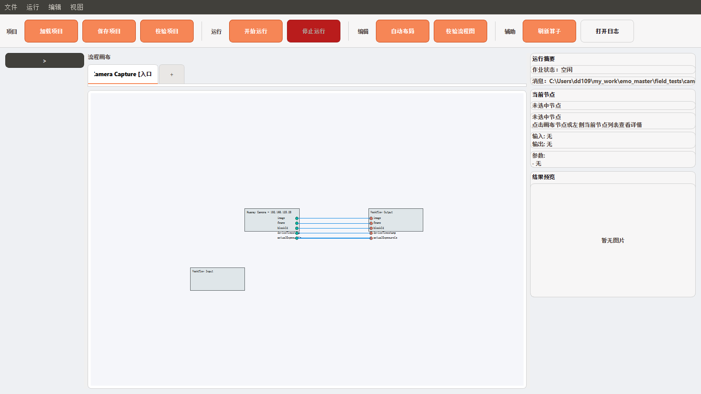
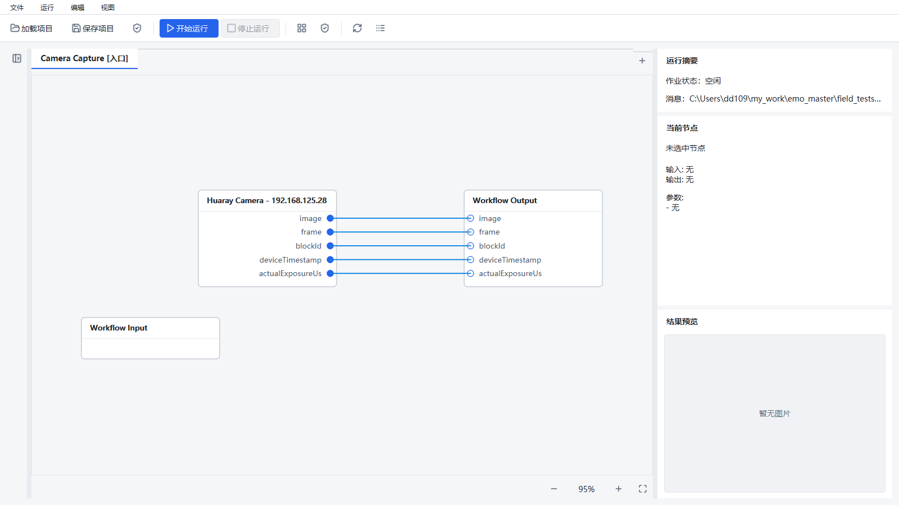

# Designer 视觉验证归档

日期：2026-09-10。完整改造和验收边界见 [验证记录](../../designer-ui-validation.md)。

本目录保留 12 张 100% 基线截图、81 张最终场景截图、7 份几何报告和测试日志。共 93 张截图约 3.5 MB，均从本地原始产物复制并核对 SHA-256；未包含现场项目、数据库、UI 缓存和中间失败截图。

下载仓库后，可用浏览器直接打开 [交互对比页](index.html)，切换各档 DPI 和窗口尺寸；无需服务、联网或相机。

## 主窗口

| 改造前 · 100% | 改造后 · 100% |
| --- | --- |
|  |  |

## 各窗口对比

| 窗口 | 改造前 100% | 改造后 100% | 改造后 200% |
| --- | --- | --- | --- |
| 主窗口 | [截图](before/main.png) | [截图](after-100/main.png) | [截图](after-200/main.png) |
| 展开栏与选中节点 | [截图](before/main-expanded.png) | [截图](after-100/main-expanded.png) | [截图](after-200/main-expanded.png) |
| 图像预览 | [截图](before/main-preview.png) | [截图](after-100/main-preview.png) | [截图](after-200/main-preview.png) |
| 项目入口 | [截图](before/project-entry.png) | [截图](after-100/project-entry.png) | [截图](after-200/project-entry.png) |
| 算子搜索 | [截图](before/operator-search.png) | [截图](after-100/operator-search.png) | [截图](after-200/operator-search.png) |
| 通用参数 | [截图](before/parameters.png) | [截图](after-100/parameters.png) | [截图](after-200/parameters.png) |
| 相机工作区 | [截图](before/huaray_camera.png) | [截图](after-100/huaray_camera.png) | [截图](after-200/huaray_camera.png) |
| ROI 工作区 | [截图](before/roi.png) | [截图](after-100/roi.png) | [截图](after-200/roi.png) |
| 直方图工作区 | [截图](before/histogram.png) | [截图](after-100/histogram.png) | [截图](after-200/histogram.png) |
| 日志 | [截图](before/logs.png) | [截图](after-100/logs.png) | [截图](after-200/logs.png) |
| 全局计数器 | [截图](before/global-counters.png) | [截图](after-100/global-counters.png) | [截图](after-200/global-counters.png) |
| 流程包预览 | [截图](before/workflow-package.png) | [截图](after-100/workflow-package.png) | [截图](after-200/workflow-package.png) |

## DPI 与窗口矩阵

| 组别 | 几何报告 | 手动适应整图 |
| --- | --- | --- |
| 100% | [JSON](after-100/report.json) | [截图](after-100/main-fit.png) |
| 125% | [JSON](after-125/report.json) | [截图](after-125/main-fit.png) |
| 150% | [JSON](after-150/report.json) | [截图](after-150/main-fit.png) |
| 200% | [JSON](after-200/report.json) | [截图](after-200/main-fit.png) |
| 1366 × 768 逻辑窗口 | [JSON](after-1366/report.json) | [截图](after-1366/main-fit.png) |
| 1920 × 1080 物理屏幕 | [JSON](after-1920/report.json) | [截图](after-1920/main-fit.png) |

跨屏：[第一屏](after-100/screen-move-0.png) → [第二屏](after-100/screen-move-1.png) → [返回第一屏](after-100/screen-move-2.png)。真实 QScreen DPR 为 1 → 1.25 → 1，手动缩放始终 120%，折叠栏始终 36。

## 测试证据与边界

- [完整 CI](ci-check.txt)：751 项通过、1 项真实相机测试跳过，protobuf、Ruff 和 mypy 通过。
- [推送前隔离复测](pre-push-ci.txt)：现有 Designer 保持运行，使用逐测试 Runtime 临时目录，751 项通过、1 项跳过，用时 80.20 秒。
- [Windows 原生 Qt 测试](native-qt-tests.txt)：20 项几何与像素测试通过。
- 基线仅为 100% 截图；150% / 200% 使用进程级 Qt 缩放，没有修改 Windows 全局显示设置。
- 200% 下自动定位为可读性保留至少 85% 缩放，因此大流程可能需要平移；手动适应截图提供整图视野。
- 所有截图使用隐藏的独立测试窗口及模拟运行时，预览色块为测试图片，相机未连接。
- 未验证真实硬件、物理 4K / 1366 × 768 显示器或安装器；不能把这些截图视作生产验收。
