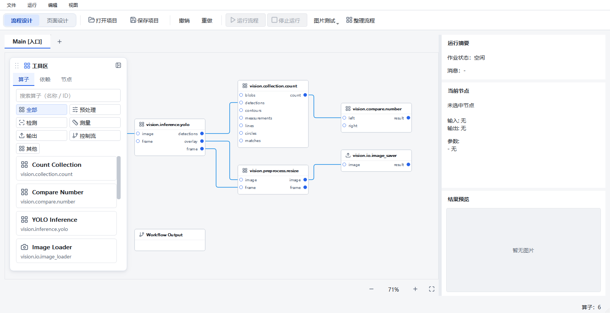
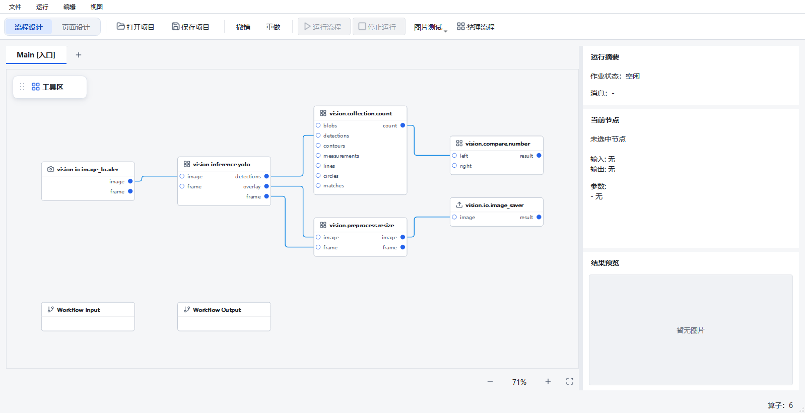
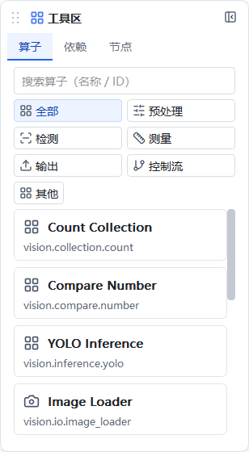

# 流程画布悬浮工具区

基于工作分支 `agent/runtime-workflow-architecture-v1` 的
`3a97f22a6faee442997acc4c0f263acd42d3240c` 增量实现，开始时工作区已有页面设计器、
工作区工具栏和动画切换等未提交改动。本轮只暂存 8 个工具区代码/测试文件及本报告证据，
其中 `main_window.py` 与 `test_visual_layout.py` 仅暂存本轮差量。原有工作区改造继续保留。

实现提交为 `5a3a85b08df35d9b0158a14ce2e9ec480d7f72a0`，树对象
`44fe15ec99577fdf1cbede9d36ec2bf7a87e9e93` 与受测的独立 8 文件候选一致。
全部原始检查日志、运行时源码摘要和原生窗口图片在
[证据目录](floating-toolbox-2026-10-04/manifest.json)。提交与独立副本的文件校验见
[commit-verification.json](floating-toolbox-2026-10-04/commit-verification.json)。

## 使用

保存当前项目并关闭 Designer 后，在仓库目录使用已有解释器重新启动：

```powershell
& "$env:USERPROFILE\.conda\envs\emo_master\python.exe" scripts/dev.py run-designer --local
```

1. 在流程画布左上角点击 **工具区**。收起时为小按钮，展开为圆角悬浮卡片。
2. 在 **算子** 页签搜索名称/ID 或选择分类；拖入画布，或点击卡片添加节点。
   名称与算子 ID 分行显示，长名称省略并保留完整提示。
   最近使用的节点优先，其他真实算子排在系统控制流模板之前。
3. **依赖** 与 **节点** 页签复用原来的依赖树和当前节点列表，可以继续导航/选择。
4. 拖住标题左侧的点阵手柄调整位置。拖动只保存本机位置偏好，不编辑项目或增加撤销记录。
   缩放/平移画布不会带走卡片；窗口缩小和外层滚动时，卡片保持在实际可见的画布范围内。
5. 点击卡片右上角收起按钮，或在工具区内按 Esc。展开/收起不移动工作流标签，也不改变
   画布大小、节点坐标和缩放。切换到页面设计时随流程视图隐藏，返回时复用原卡片。

窄屏和高 DPI 下需要滚动工具区内容；搜索、全部分类和算子条目仍可到达。
不自动排列节点，不修改执行顺序、绑定、项目格式或 Runtime 行为。
当前已打开的 Designer 不会热加载代码；本轮没有结束用户已有进程。

## 实现和边界

- `ui/floating_toolbox.py` 独立维护卡片、页签、位置偏好和祖先裁剪边界，`MainWindow` 仅增加
  11 行适配。卡片由 `DesignerGraphicsView` 持有；若挂在 viewport，Qt 会将它随场景一起滚动。
- `LayoutController` 保留三项分栏设置和旧的非 Qt 路径；原生 Qt 不再为工具区预留竖栏。
  展开/收起不重新分配分栏尺寸。没有增加布局参数或写入项目 JSON。
- `OperatorBubble` 增加内嵌模式，复用同一份目录、图标提供器、搜索/最近使用和
  `application/x-emo-operator` MIME。没有第二套算子列表模型、Runtime、订阅或执行器。
  原独立工具窗口和无 Qt 兼容分支保持原行为。
- 图标绑定仍使用既有有界提供器与可见条目机制。新增卡片/阴影由 Qt 父对象持有；没有新增
  定时器或后台队列。关闭窗口停止既有图标刷新，销毁后不留下事件过滤器回调。
- 首轮小窗口验证暴露了外层流程滚动区裁剪；修复同时限制可见范围与页签最小尺寸，
  不放大窗口、不降低 DPI、不删可达性断言。位置测试明确区分窄屏裁剪与足够宽窗口中的恢复。

## 验证口径

Windows、已有 Conda `emo_master`，Python 3.10.21、PySide2 5.15.2.1。
不安装依赖、不更换 Qt。每次运行的 `*-provenance.json` 保存真实 HEAD、dirty、源码摘要、
命令、退出码与 monotonic 耗时；源码在相应测试运行期间不变。
独立副本 detached 于起始 HEAD，只叠加 8 个暂存文件，排除已有未提交界面改造。

| 检查 | 实际结果 |
| --- | --- |
| 修改前相关基线 | 55 PASS |
| 最终原生 Windows 工具区与受影响回归 | 102 PASS，18.85 秒 |
| 仅本轮 8 个文件的独立副本 | 84 PASS，9.68 秒 |
| 非 Qt 分支受控导入失败探针 | PASS：旧搜索、排序和最近使用语义；不是另一台无 Qt 电脑验收 |
| 最终窗口矩阵 | 12/12 PASS：1280×720、1600×900、1920×1080，各 100%、125%、150%、200% |
| 最终完整 CI | FAIL：1 FAIL、2657 PASS、8 SKIP、26 subtests PASS；pytest 679.06 秒，完整脚本 681.95 秒；proto-drift、Ruff、mypy PASS |

最终原始记录：[原生回归](floating-toolbox-2026-10-04/raw/clip-final-native.txt)、
[独立副本](floating-toolbox-2026-10-04/raw/isolated-clipped.txt)、
[完整 CI](floating-toolbox-2026-10-04/raw/ci-clipped-final.txt)、
[最终矩阵](floating-toolbox-2026-10-04/raw/matrix-final.json)。相邻的 provenance 文件保留
每次运行的真实 HEAD、dirty、源码 SHA256 和时钟口径。8 个跳过项不计作通过。

20 个新增专项覆盖画布/标签不挪动、目录/分类/搜索、真实 QWidget 拖动阈值与 MIME/viewport
drop 传递、一次节点事务和撤销、Esc、位置裁剪/恢复、短窗口滚动、祖先滚动、页面切换、
图标刷新取消、所有者关闭和销毁。拖放测试用 Qt 事件驱动窗口，不声称录制了人工鼠标验收。

专项复现：

```powershell
$env:QT_QPA_PLATFORM = 'windows'
$env:PYTHONUTF8 = '1'
Remove-Item Env:PYTHONIOENCODING -ErrorAction SilentlyContinue
Remove-Item Env:QT_SCALE_FACTOR -ErrorAction SilentlyContinue
& "$env:USERPROFILE\.conda\envs\emo_master\python.exe" -m pytest tests/designer/test_floating_toolbox.py tests/designer/test_sidebar_collapse.py tests/designer/test_main_window_layout.py tests/designer/test_operator_bubble.py tests/designer/test_visual_layout.py tests/designer/test_workflow_tab_add_button.py tests/designer/test_main_window_project_save_load.py tests/ui/page_designer/test_workspace_modes.py tests/ui/page_designer/test_workspace_switch.py -q
```

完整 CI 使用原脚本及全部正式测试：

```powershell
$env:QT_QPA_PLATFORM = 'offscreen'
$env:PYTHONUTF8 = '1'
$env:PYTEST_ADDOPTS = '--ignore=manual_test_workspace'
Remove-Item Env:PYTHONIOENCODING -ErrorAction SilentlyContinue
Remove-Item Env:QT_SCALE_FACTOR -ErrorAction SilentlyContinue
& "$env:USERPROFILE\.conda\envs\emo_master\python.exe" scripts/ci_check.py
```

只排除包含冻结历史副本的 `manual_test_workspace`，不排除正式测试。
原生窗口截图复现（输出目录必须不存在）：

```powershell
$env:QT_QPA_PLATFORM = 'windows'
$env:QT_SCALE_FACTOR = '2'
& "$env:USERPROFILE\.conda\envs\emo_master\python.exe" docs/testing/floating-toolbox-2026-10-04/capture.py --output manual_test_workspace/floating-toolbox-new --width 1280 --height 720 --physical-screen
```

尺寸/DPI 矩阵使用同一 Windows 桌面、真实 Qt 窗口和实际 DPR；扣除原生边框/任务栏后记录
实际客户区。它没有改变操作系统分辨率，不代表多台工控机、安装包或现场验收。
截图读取 6 个正式内置算子的 manifest/端口，未执行算子，也未创建 Runtime 或 Job。

展开效果（1600×900、100%）：



收起后保留完整画布：



卡片名称与 ID 分行：



1280×720、200% 的实际客户区为 638×319 逻辑像素，依赖/节点内容在悬浮卡片内滚动：


这些原生窗口截图包含开始时已有的工具栏/工作区未提交样式；本轮提交不包含那些改动。
独立副本测试验证仅提交本轮代码也能运行。截图与完整 CI 的受测对象是包含已有改动的
工作区，不能混同为干净提交的完整 CI。

## 保留失败与限制

- 首次候选含 PySide2 `QShortcut` 构造错误；后续发现 viewport 子控件随场景滚动、卡片文本
  行距和小窗口祖先裁剪问题。原始日志/截图全部保留，不将首次候选改记为 PASS。
- 首次完整检查发现无 Qt 兼容分支误引用内嵌字段，已恢复旧分支并单独验证。
- 随后的完整 CI 曾为 **2 FAIL、2655 PASS、8 SKIP、26 subtests PASS**：新位置测试错误假设
  offscreen 的初始屏幕能容纳恢复位置，已补充分别验证裁剪/扩大窗口恢复；另一项
  `testNarrowToolbarKeepsRunActionAndHasOverflow` 在本轮改动前的 dirty 工作区副本中同样失败。
  原生 Windows 专项通过不替代该 offscreen 失败，不删除其“运行按钮可见”断言。
  最终完整 CI 只剩这 1 项失败；[改动前复现日志](floating-toolbox-2026-10-04/raw/baseline-toolbar-offscreen.txt)
  和源码摘要保留，证明失败已存在于起始 dirty 工作区，而非证明干净 HEAD 也失败。
- 较早的广泛原生运行为 **2 FAIL、611 PASS**：旧侧栏显隐断言已按页签结构补强，后续通过；
  P5 独立运行页面探针发生 40 秒内部 deadline/60 秒父进程等待超时，`steps` 为空。
  该探针不加载 Designer，保留为独立运行链路未解决记录，不仅凭一次其他测试通过判定修复。
  [原始失败日志](floating-toolbox-2026-10-04/raw/regression-native.txt)保留 60 秒超时堆栈；
  40 秒内部 deadline、空 `steps` 来自当时查看 `view.json` 的观察记录。
  收尾时该 pytest 临时目录已不存在，不能再单独复核该临时 JSON/运行日志；不重造缺失证据。
- 既有 A18、Qt 间歇崩溃、运行页面性能与资源稳态记录不改判。
  Linux 原生窗口、冻结包、真实设备、另一台电脑和现场发布 **NOT_RUN**。

本轮交付流程工具区 UI，停止在此范围，不进入发布。
