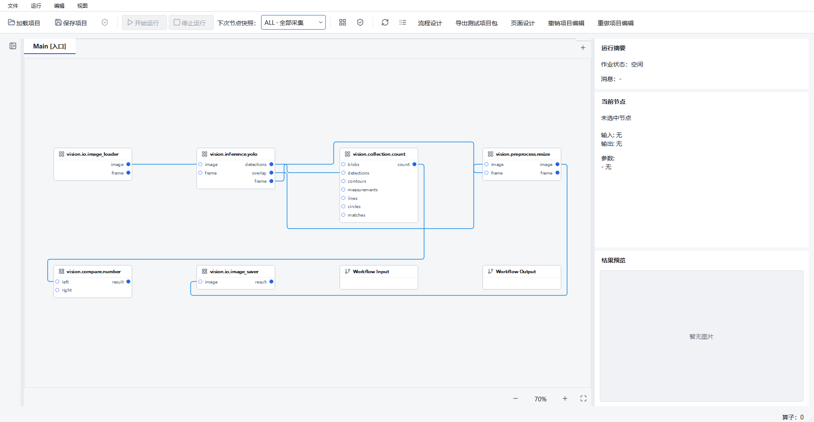
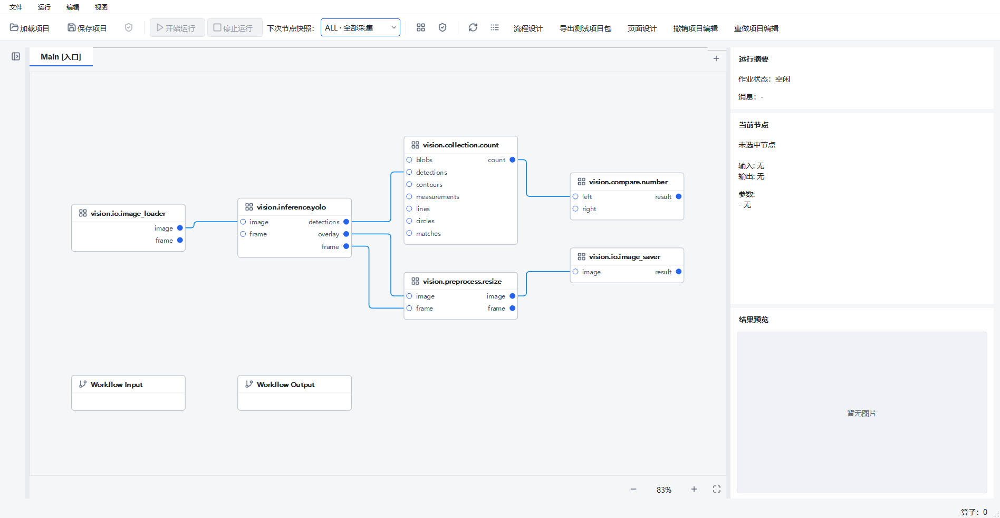

# 流程按数据流自动整理与圆角避障连线

范围：仅 Designer 流程画布的坐标和连线显示。当前工作分支
`agent/runtime-workflow-architecture-v1`；起点
`f2781e18f816c67a5ea13814cf0928fbe74ec770`，起始工作区干净。

实现提交：

- `4d555de`：Qt 无关的分层布局、正交路由及算法测试。
- `55863779cbaa43153c9bc553ee448076f99b6a86`：画布适配、一次撤销、Qt 专项和截图测量脚本。

## 使用及行为

源码启动 Designer，在当前流程点击“编辑 → 自动布局”或同名工具栏按钮。
上游在左、下游在右，分支上下排列；未连接节点（包括未连接的 Workflow Input/Output）
置于全部已连接分组下方。节点实际宽高及所有端口均保留。

一次整理进入既有 `draftCommand` / `ProjectEditSession` 历史，可整体撤销、重做。
再次整理相同图和尺寸，坐标一致，不新增无效撤销记录。保存仍只有
`layout.nodePositions`；路由不落盘，没有项目格式升级。
加载旧项目保留旧位置，仅改用圆角折线；接线及执行不会触发布局。

手动拖动时更新关联线，松开后全图重新避障；移动无关联节点也会在松开后更新全图。
重叠节点封住通道时，连线呈橙色虚线并带悬停说明。它仍可独立选中、删除。
布局不修改节点、参数、端口、边、校验结果、其他流程、页面绑定或 Runtime。

## 实现边界

`flow_layout.py` 输入稳定 ID、尺寸、节点种类和有向连线，输出坐标。
迭代式强连通分解处理环形草稿，凝聚图按拓扑最长路径分层；同一强连通组内按稳定 ID 展开。
固定 8 轮前后重心扫描改善同层排序。水平基础间距 120、垂直 64 逻辑像素，
超过 3 条跨层连线后，每条增加 10 像素通道；独立连通分组垂直间隔 128。
环内不能让所有有向边都向右，回边由路由绕行，原有非法环仍需原校验处理。

`flow_routing.py` 构建共享正交可见性网格，以带进入方向的 A* 搜索路径。
节点内部为硬障碍，12 像素安全距离外再保留 8 像素圆角余量。
源输出向右出框、目标输入从左入框；只允许各自的出入短段穿过本节点。
角半径不超过 8 且不超过相邻段长度的一半。
路由成本包含长度、折弯（32）、交叉（240）及共线重叠长度（5 倍）惩罚。
目标通道按端口实际纵坐标分配；入口禁止先越过目标通道再反向折返。
这是确定性的启发式布线，不承诺任意复杂图零交叉或最优布线。

`FlowScene` 只适配尺寸、端口及 `QPainterPath`。批量移动暂停刷新，结束一次路由；
普通变更使用 scene 所有的单次 QTimer 合并刷新。`clear()` / `clearGraph()` 先停 timer，
销毁 scene 同时销毁其 timer；不使用无所有者的延迟回调。
MainWindow 仅把原自动布局调用改为 `layoutNodesFlow()`，保留 `layoutNodesGrid()`。

## 真实 Qt 截图与项目证据

同一专用测试窗口、正式算子 manifest 的全部端口：本地图像输入 → YOLO，
YOLO detections → count → compare；YOLO overlay/frame → resize → saver。
两个未连接边界节点保留。这里只验证编辑，不执行 YOLO 或设备。

整理前为旧四列位置配本次新连线样式（不是旧版本贝塞尔截图）：



整理后：



截图中的 count → compare 向右，YOLO 图像支路独立展开；全部正常路径均经检查，
不穿过无关节点的 12 像素扩大框。自动布局、撤销、重做、保存重开、缩放及窗口退出成功。

[原始截图及逐轮数据](flow-auto-layout-2026-10-02/validation.json) 记录实际受测 HEAD 为起点、
dirty=True；当时功能代码未提交。[摘要核对](flow-auto-layout-2026-10-02/committed-source-check.json)
确认这些源码工作区原始 SHA-256 与截图记录相同，归一化 Git 的 CRLF/LF 后与 `5586377` 完全一致。
最终 CI 另有提交后的源码摘要，不能把早期 dirty 测量写成在干净提交上测试。

## 环境与可复现命令

Windows 10.0.26200 x64，Python 3.10.21，PySide2 5.15.2.1，已有 Conda 环境；未重装依赖。
所有截图使用原生 `windows` 平台；无真实设备、现场数据或用户项目修改。

```powershell
Set-Location 'D:\jsdfhasuh\documents\my_project\emo_master'
$py = "$env:USERPROFILE\.conda\envs\emo_master\python.exe"
$env:QT_QPA_PLATFORM = 'windows'
$env:HUARAY_CAMERA_SMOKE = '0'
& $py -m pytest tests/designer/test_flow_layout_routing.py tests/designer/test_flow_layout_qt.py tests/designer/test_flow_scene_interactions.py tests/designer/test_visual_layout.py -q -ra
& $py scripts/validate_flow_layout.py --output "manual_test_workspace/flow-layout-$(Get-Date -Format yyyyMMdd-HHmmss)"

$env:QT_QPA_PLATFORM = 'offscreen'
$env:PYTHONPATH = "$PWD/src"
$env:PYTEST_ADDOPTS = '--ignore=manual_test_workspace -ra'
& $py scripts/ci_check.py
```

只有本地证据目录中存在旧完整基线副本时，才需要上述 `--ignore=manual_test_workspace`。
本轮未修改 pytest 配置。默认 CI 的原始失败日志也保留，不能声称原命令首次即全通过。

## 检查结果

原生 Windows Qt 专项（上述四个测试文件，代码 `5586377`）：**50 passed，9.92 秒，无跳过**。
包括 17 项本轮新增用例及既有交互、布局回归。
[原始输出](flow-auto-layout-2026-10-02/native-focused.log)。
最终实现的 `ruff check src tests scripts/validate_flow_layout.py` 和
`mypy --config-file mypy.ini src` 通过；mypy 检查 288 个源码文件。

最终提交 `55863779cbaa43153c9bc553ee448076f99b6a86` 的完整 CI：
**proto-drift、Ruff、mypy 通过；2556 passed、8 skipped、26 subtests passed，688.96 秒，退出码 0**。
运行期间实现源码未改变，dirty 仅为开发文档；
[受测上下文及摘要](flow-auto-layout-2026-10-02/ci-final-context.json)、
[完整原始日志](flow-auto-layout-2026-10-02/ci-final.log)。
只排除了本机 `manual_test_workspace` 中的旧完整副本，没有排除任何正式测试。

8 项跳过分为：6 项 Windows 符号链接权限不足、1 项真实 IMV 相机 smoke 未启用、
1 项仅适用于非 Windows 的平台拒绝分支。它们不计为通过。
本次 A18 通过，但同轮开发期完整回归仍实际失败；既有间歇问题保持未解决状态，
其新增线程来源未在本轮完成归因，不能以最终一次通过宣称已修复。

本轮布局、路由、Qt 交互及项目状态验收通过；原运行页面长期性能、资源稳态、
Qt 组合稳定性及现场发布仍沿用既有结论，不因本轮通过而升级。

专项覆盖链式、分支汇合、跨层、多个独立流程、孤立及边界节点、不同宽高、
1100 节点长链、环、自环、确定性、多端口通道和超密连线间距。
Qt 专项覆盖圆角 path、无关联障碍移动、受阻虚线及提示、鼠标端口拖拽、
不同缩放下命中选择、删除、拖动时局部刷新及释放后全局刷新、一次批量刷新、
待刷新时清空和 native 销毁、整次撤销重做、保存重开及其他流程不变。

保留的开发期失败与限制：

- 最初新 Qt 测试先导入 PySide2，再导入项目 Windows DLL 预载入口，出现 native 异常诊断。
  修正新测试的导入顺序；不将它归为旧 A18，也不改生产 DLL 加载策略。
- 最初保存重开断言查看了默认入口流程，而被整理的是另一流程。
  修正夹具重新切到同一流程后比较全部位置和图数据，没有删除断言。
- 默认 `python scripts/ci_check.py`：proto、Ruff、mypy 通过，pytest 收集失败（4 个错误）。
  原因是 `manual_test_workspace/source-launch-check/baseline-20261002-192152` 旧完整副本被递归收集，
  出现 import path mismatch 和错误源码导入。[原始日志](flow-auto-layout-2026-10-02/ci-collection-failure.log)。
- 开发期完整回归（仅忽略上述本地证据目录）：2554 passed、1 failed、8 skipped、26 subtests passed，
  657.42 秒。A18 在 `hidden_observers` 阶段发现 native_threads 63 → 65，handles 2235 → 2235。
  [原始日志](flow-auto-layout-2026-10-02/ci-development.log)。运行期间还有路由细节修改，
  因此最终提交需要独立回归，不能只引用这次结果。
- 早期 offscreen 截图字体/视口不完整，以及未等异步 fit 稳定就抓图的原生截图，
  均未用作最终视觉证据；截图脚本现等待真实 `_pendingFit` 状态，另有 3 秒外层截止。
  没有用固定 sleep 或修改生产显示逻辑掩盖问题。
- 仍保留既有 A18 资源稳态失败、Qt 组合崩溃及原运行页面性能 FAIL。
  本轮没有修复这些问题，也不允许凭一次回归通过宣称长期稳定。

[开发期尝试记录](flow-auto-layout-2026-10-02/development-attempts.json)；
本机全部原始日志和早期截图位于 `manual_test_workspace/flow-layout-check/`，未删除旧失败。

## 40 节点、45 边交互测量

原生 Windows Qt，实际节点多端口尺寸；`time.perf_counter`，单位 ms。
1 轮预热 + 5 轮全部报告，每轮 20 次关联节点移动。布局算法、应用+路由、视口 fit/绘制、
拖动+事件处理+同步 repaint、松开全图路由+repaint 分开计时。
测量在普通开发桌面运行，期间存在完整 CI 负载；不是受控硬件性能认证。

| 阶段 | 中位数 | 最大值 |
| --- | ---: | ---: |
| 纯布局 | 0.997 | 1.067 |
| 应用位置并全图路由 | 22.998 | 25.233 |
| 视口 fit、事件处理及绘制 | 4.658 | 5.162 |
| 关联节点拖动及绘制（100 次） | 10.865 | 20.994 |
| 松开后全图路由及绘制 | 27.806 | 30.912 |

五轮均无受阻连线。[validation.json](flow-auto-layout-2026-10-02/validation.json) 保留全部原始值。
这是中等规模编辑响应数据，不是原 1080p/5Hz 展示链路验收，也不是目标工控机性能结果。
超大密集图、真实设备、EXE/发布包、现场验收均 NOT_RUN。本轮不扩展编辑器或 Runtime 功能。
