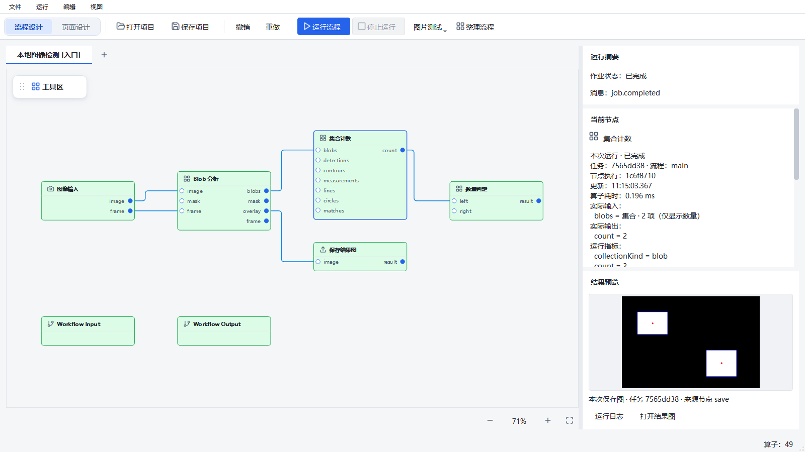
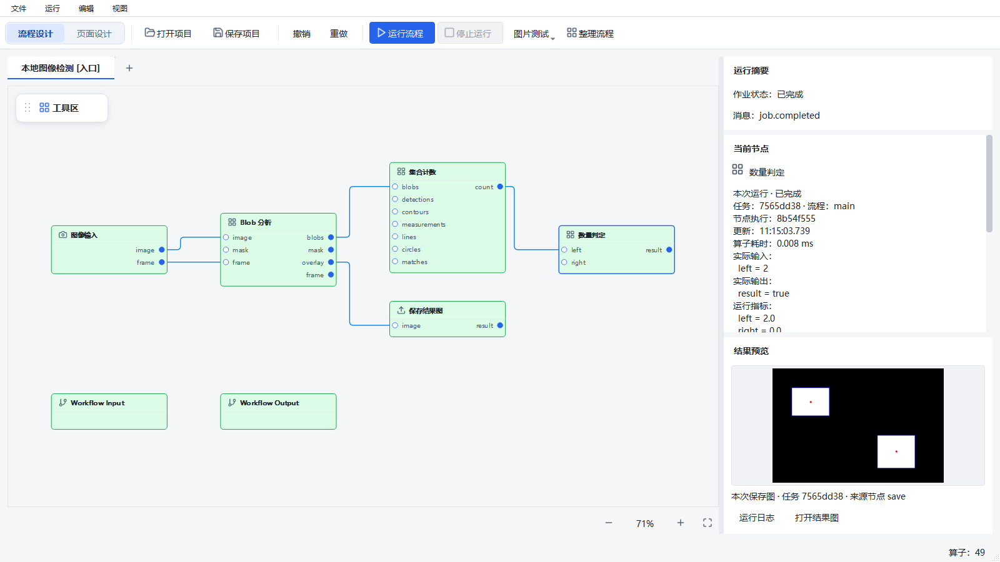
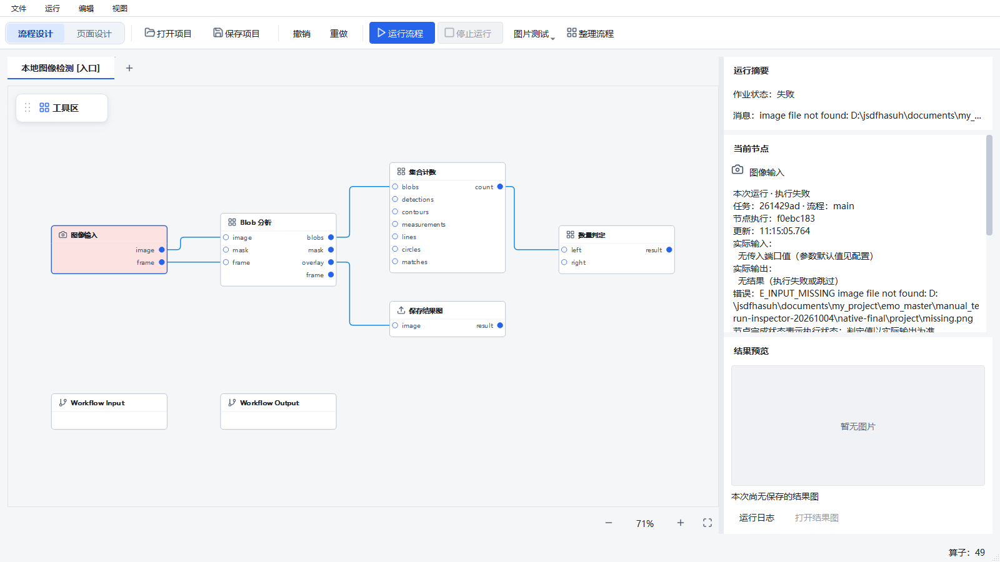

# 流程设计中的节点运行查看（2026-10-04）

本轮在原生 Designer 的“流程设计 → 当前节点”增加实际输入、输出、算子上报耗时、诊断和错误。仍使用原 WorkflowRunner、RuntimeWorker 和已有事件订阅；选择节点不启动任务。结果预览复用原保存图片控件，增加来源标识、运行日志与打开文件入口。

起始 HEAD：`9276d30d99df6bdf2af8b01862c3778ccd44d04d`。分支：`agent/runtime-workflow-architecture-v1`。
功能提交：`7b0ac467091c8188dbc5d7036d5f6898bd4d2eb6`，已正常推送并用 `git ls-remote` 独立核对。
开始时已有 26 个 tracked dirty 文件和 11 个 untracked 状态项；本轮保留这些内容。
`main_window.py` 和开发指南按“任务开始时文件 → 本轮文件”的差分独立暂存，未混入此前的工作区、工具栏及页面设计器改动。

## 使用

保存当前项目并正常关闭旧 Designer，再从已安装的 Python 3.10 环境启动：

```powershell
& "$env:USERPROFILE\.conda\envs\emo_master\python.exe" scripts/dev.py run-designer --local
```

1. 在流程设计明确开始运行，点击需要检查的节点。右侧当前节点区直接显示实际数据；下面的端口类型和参数配置仍保留。
2. 计数 `0`、判定 `false` 和空值不会被当作没有数据。图像只展示尺寸摘要，集合只展示数量；没有输出、失败或跳过会明确说明。
3. 保存节点产生图片后，下方结果预览显示当前任务的保存图；运行日志打开原日志面板，打开结果图只适用于本机可访问的文件。
4. 新任务和再次执行清除旧输出；重复、乱序和旧节点执行的迟到完成消息不能恢复旧成功值。完整调用历史继续查看日志，面板只保留最近观察到的执行。
5. 新代码不会更新已经打开的窗口。外部 Runtime 也需更新才能提供输入摘要；旧事件只展示其已经上报的信息，明确标记输入缺失。

内嵌 `--local` 模式的 Runtime 日志默认在 `manual_test_workspace/runtime-embedded/logs/`。
Runtime JSONL 已有轮转和保留规则仍是每文件 64 MiB、14 天、总量 2 GiB；GUI 本地缓存与服务端落盘日志分别存在。本轮不更改数据库格式、项目格式、执行顺序、算子语义或计数行为。

## 契约与边界

- `core/contracts/run_inspection.py` 在执行前冻结输入描述、执行后生成输出描述，写入既有节点事件的可选 `ioSummary` 字段。旧 `outputs`、指标和诊断继续保留；JSONL 只额外保存有界描述，仍剔除完整 `outputs`。
- 描述不复制数组、遍历集合、调用插件值的任意 `str()`，也不从诊断字符串推断输出。图片保留 shape/dtype 元数据，正式集合对象及其 DTO 保留数量。敏感端口名称的摘要值隐藏。
- `NodeRunInspection` 按 Job、工作流、节点执行标识与消息序号保留当前观察。输入、输出与耗时属于同次节点调用；循环索引另列。失败、跳过、运行中均没有有效完成输出，换 Job 及关闭所有者清理新增缓存。
- `node_run_presenter.py` 独立生成只读文案；`RunResultTools` 独立维护入口与换行高度。MainWindow 负责连接当前选择与现有事件状态。
- 只缓存已成功加载图片的身份，避免同一 artifact 在每次元数据刷新时重新解码。文件缺失或加载失败后仍可重试；没有新增位图缓存、Runtime、Job、读图请求或订阅。

| 新增数据 | 固定边界和口径 |
| --- | --- |
| 每侧端口 | 最多 12 个；紧凑 UTF-8 JSON 预算 1792 字节 |
| 单次输入＋输出描述 | 不超过 4096 字节紧凑 UTF-8 JSON |
| 单个界面节点记录 | 不超过 8192 字节紧凑 UTF-8 JSON，包含身份、指标及诊断 |
| 新增界面记录总量 | 最多 64 个工作流/节点条目，最多 512 KiB 上述 JSON 字节；按最早更新淘汰 |

这是新增逻辑 payload 的预算，不是 Python 堆、RPC 的 ASCII 转义传输量、原日志缓存或整个 Runtime 的总内存承诺。已有历史状态、预览及资源稳态缺口继续跟踪。

## 实际验证

Windows、Python 3.10.21、PySide2 5.15.2.1，使用已有 Conda 环境，没有安装或升级依赖。
所有运行使用 `HUARAY_CAMERA_SMOKE=0`。本地图像、项目、SQLite、Job 目录、输出和日志均在独立测试目录；不操作用户正在运行的窗口、真实设备或现场数据库。

每份 `*-provenance.json` 记录真实 HEAD、dirty、源码 SHA256、命令、平台、退出码与 monotonic 秒数。最终代码的 14 个 source/test/example 文件与独立受测候选逐一相同，见 [提交核对](flow-run-inspector-2026-10-04/commit-verification.json)。非任务 src/tests/scripts 文件与初始 dirty 基线摘要相同。
截图和完整 CI 来自含原有未提交 UI 改动的工作区；独立副本只包含起始 HEAD 与本轮代码，不能把两者的测试范围混同。

| 检查 | 真实结果 |
| --- | --- |
| 修改前相关基线 | 56 PASS，10.91 秒 pytest |
| 最终相关回归 | 137 PASS，9.06 秒 pytest |
| 仅本轮代码的独立副本 | 137 PASS，11.09 秒 pytest |
| 首次完整 CI | FAIL：1 FAIL / 2686 PASS / 8 SKIP / 26 subtests PASS；pytest 693.66 秒 |
| 最终代码完整 CI | FAIL：1 FAIL / 2688 PASS / 8 SKIP / 26 subtests PASS；pytest 685.48 秒、整个脚本 688.42 秒；proto-drift、Ruff、mypy PASS |
| 真实 Qt 功能路径 | 100%、150%、200% 三次均完成正常 Job、缺图失败 Job、节点点击、日志入口和正常退出 |

原始记录：[基线](flow-run-inspector-2026-10-04/raw/baseline.txt)、[最终回归](flow-run-inspector-2026-10-04/raw/regression-footer-final.txt)、[独立副本](flow-run-inspector-2026-10-04/raw/isolated-final.txt)、[首次完整 CI](flow-run-inspector-2026-10-04/raw/ci-final.txt)、[最终完整 CI](flow-run-inspector-2026-10-04/raw/ci-final-footer.txt)。相邻 provenance 文件保留代码口径，8 个 skip 不算通过。

新增 31 项覆盖真实 Runner 的本地图像/Blob/计数/比较/保存、输入变更前冻结、失败与跳过、JSONL 摘要保留、假值、无穷/NaN、大整数、UTF-8/JSON 转义预算、集合不遍历、未知对象不调用用户代码、跨工作流及换 Job、重复和乱序、淘汰、旧事件缺失、实际 QWidget 选择、日志/文件操作、图片解码复用与缺文件重试、换行边界及关闭清理。

专项复现：

```powershell
$env:QT_QPA_PLATFORM = 'windows'
$env:PYTHONUTF8 = '1'
& "$env:USERPROFILE\.conda\envs\emo_master\python.exe" -m pytest tests/core/test_run_inspection.py tests/designer/test_node_run_inspection.py tests/designer/test_run_inspector_ui.py tests/runtime/test_runner_io_summary.py tests/designer/test_current_node_details.py tests/designer/test_runtime_panel.py tests/designer/test_runtime_controller.py tests/designer/test_log_dialog.py tests/runtime/test_dag_executor.py tests/runtime/test_jsonl_logging.py tests/runtime/test_runtime_workflow_architecture.py tests/runtime/test_workflow_subflow_contracts.py tests/runtime/test_workflow_loop_contracts.py tests/runtime/test_workflow_loop_contracts_v2.py -q
```

完整检查仍使用原脚本及全部正式测试：

```powershell
$env:QT_QPA_PLATFORM = 'offscreen'
$env:PYTHONUTF8 = '1'
$env:PYTEST_ADDOPTS = '--ignore=manual_test_workspace'
Remove-Item Env:PYTHONIOENCODING -ErrorAction SilentlyContinue
Remove-Item Env:QT_SCALE_FACTOR -ErrorAction SilentlyContinue
& "$env:USERPROFILE\.conda\envs\emo_master\python.exe" scripts/ci_check.py
```

仅排除包含冻结副本的 `manual_test_workspace`，没有排除正式测试或修改既有断言。

## 原生窗口与截图

可复现命令（输出目录必须不存在）：

```powershell
$env:QT_QPA_PLATFORM = 'windows'
$env:PYTHONUTF8 = '1'
& "$env:USERPROFILE\.conda\envs\emo_master\python.exe" docs/testing/flow-run-inspector-2026-10-04/capture.py --output "manual_test_workspace/flow-inspection-$(Get-Date -Format yyyyMMdd-HHmmss)"
```

脚本从 240×360 的固定本地图像执行正式算子，两个白色对象得到 `count=2` 和 `result=true`，保存叠加图片。窗口通过原 RuntimeController 明确开始工作，实际执行在 spawn 子进程中；通过原事件流进入 GUI。打开窗口和点击节点时 Job 数为 0/1，失败注入是第二次明确开始，未产生隐式启动。
第二次将图片改为不存在路径，真实 Job 返回 `E_INPUT_MISSING`；失败节点不保留输出，未执行的计数节点和保存图不回退到第一轮结果。关闭后新增摘要缓存为 0，测试 Runtime 已关闭。

| 设置 | 实际客户区 / DPR | 正常任务时新增摘要 / 关闭后 |
| --- | --- | --- |
| 1600×900、100% | 1600×900 / 1 | 5369 / 0 字节 |
| 请求 1280×720、150% | 1256×640 / 1.5 | 5368 / 0 字节 |
| 请求 1280×720、200% | 936×468 / 2 | 5367 / 0 字节 |

以上是同一 Windows 桌面的真实 Qt 功能验证；高 DPI 尺寸受屏幕可用空间裁剪，短窗口需要纵向滚动。没有声称全部尺寸的所有字段同时可见，也不是工控机或跨机验收。

计数节点与保存图：



比较节点：



新一轮缺图失败，旧结果已经清除：



## 保留失败及未验收项

- 首次专项的重复测试文件名导致 collection error；随后测试构造错用了节点上下文字段、遗漏工作流出口、匹配了时间中的 `123`、未同步画布选择及比较了路径分隔符。这些失败记录保留；修正测试构造和精确对象断言，没有删除期望值或减小覆盖。
- 首次高 DPI 的功能脚本虽返回 0，截图与几何检查发现新增来源文字换行后工具条覆盖图片。200% 时图片底边为 133，工具条起点为 123。修复动态最小高度后起点为 140，正式测试与截图脚本增加不重叠断言；原截图保留，不当作视觉通过。
- 首次单独运行新增 Qt 专项时，日志打印 ONNX Runtime/Qt DLL 导入阶段的 native access violation，最终进程仍为 0、38 项通过；此记录不计作干净稳定性通过。新增测试曾先导入 Qt，再进入应用预加载。已修正该测试导入顺序，后续同命令无此异常；这不证明历史 Qt 组合崩溃已经解决。[原始异常](flow-run-inspector-2026-10-04/raw/footer-ui.txt) 保留。
- 完整 CI 的 `testNarrowToolbarKeepsRunActionAndHasOverflow` 在 offscreen 640 宽下看不到运行按钮，仍失败。此前 dirty 副本已有同项复现，见 [原基线证据](floating-toolbox-2026-10-04/raw/baseline-toolbar-offscreen.txt)。本轮不改工具栏测试，不用原生单次通过代替该失败。
- 原 A18、Qt 间歇崩溃、1080p/5 Hz 性能和资源稳态记录保持原状态。本轮没有重做性能或稳定性验收；上面的单图功能样例不能替代它们。
- 任意图像端口的完整逐节点读图、所有循环调用历史、远端保存路径跨机访问、冻结包、真实相机/PLC/机器人、现场发布均不属于本轮，也未验收。

本轮交付流程设计内的有界运行检查；不进入后续阶段或现场发布。
