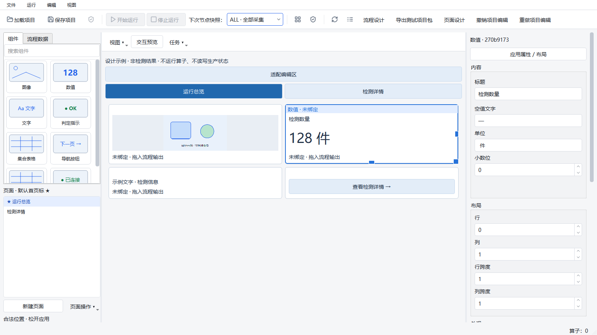
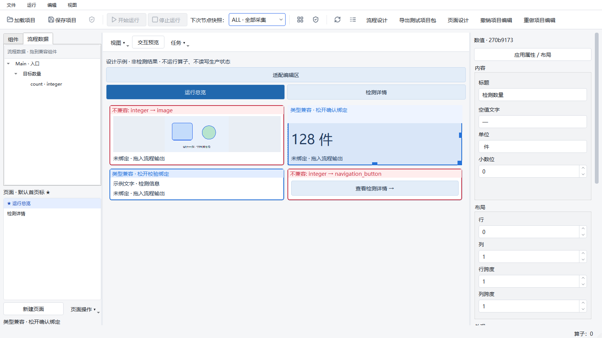
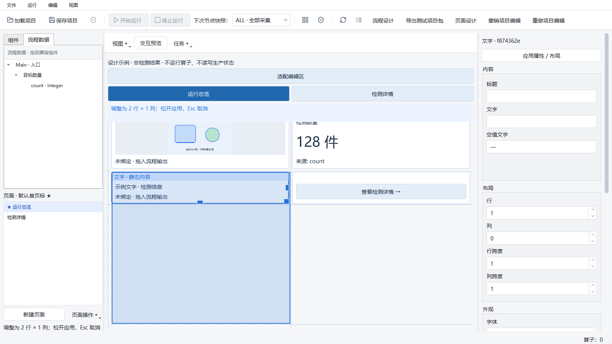
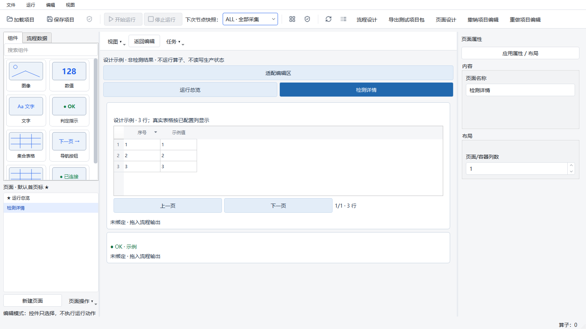
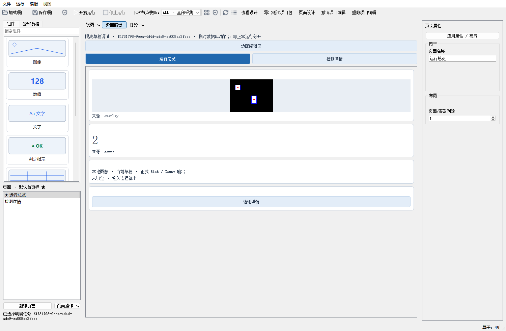

# 页面设计器可视化与编辑体验验证（2026-10-02）

本轮实现范围为页面编辑体验：继续使用 Python 3.10、PySide2、正式页面模型、统一项目事务和共享渲染器。没有增加组件类型、执行能力、项目格式字段、Runtime 订阅或发布入口。

起点为 `agent/runtime-workflow-architecture-v1` 的 `3e86e4dbfaf7570064bd921e4eaccaf21627a262`，工作区干净。前两批提交为：

- `78a10ee`：三栏、可折叠侧栏、原生组件缩略图与搜索。
- `d88a15bcdcae2c016550e3194bd073a82503b296`：设计示例与按类型属性分组。
- 第三批包含画布手柄、落点校验、生命周期、真实 Qt 测试及本文证据。

第三批验证在 `d88a15b…` + dirty 候选上执行；证据保留 HEAD、dirty 清单及 SHA-256，不将它冒称为干净提交上的运行。最终受测源码与提交内容通过逐文件摘要核对。

编辑功能与原生用户路径通过；整体稳定性验收仍未通过。最终 CI 唯一失败为未修改断言的 A18：`navigation index=399`，native_threads 63→65、handles 2549→2549；新增 native thread IDs 为 75616、88712。与已存在的失败模式一致，但线程来源与长期稳态仍未解决，不能判定无害或豁免。锁测试和本轮引入的独立离线模式回归在最终 CI 均通过。

## 已交付行为

- 主程序“页面设计”进入三栏工作区。组件库包含现有八种组件，Qt 原生绘制缩略图；宽栏两列、窄栏一列、名称搜索、带缩略图的原 MIME 拖放。
- 左侧“组件／流程数据”标签页与页面列表；页面复制、排序、默认首页等操作进入菜单。三栏宽度是本机偏好，不进入项目撤销。
- 顶部“视图／交互预览／任务”在窄画布仍可操作。“视图”管理侧栏、任务详情、设计示例和旧离线状态；不将多行无任务状态堆在编辑画布上。
- 设计示例默认开启，持续标记“设计示例 · 非检测结果”。示意图共享，标量、文字、映射、表格使用组件实际配置；未绑定提示仍保留。示例不产生 SessionView、Job、真实 resultKey、项目资源或业务计数。
- 接收真实快照先退出示例；旧离线 OK/NG 模式也不能跨越真实会话快照。等待、断线、失败及无采集清单不回退示例。工作线程在接触 QWidget 前被拒绝。
- 属性按类型显示内容、布局、外观、数据绑定；页面未选中组件时可改名称和列数。隐藏属性保留原值，长名称不撑宽侧栏，表单保留待提交校验和错误提示。
- 编辑态点击只选择；蓝色边框显示类型和绑定摘要。右、下、右下角手柄调整列、行及两者。移动与调整仅在松开后提交一个事务；重叠、越界、非法容器和 Esc 取消不产生该次布局历史。
- 输出拖放显示类型兼容提示；落点使用与提交相同的正式命令进行隔离草稿校验，仍执行来源、作用域、可选输出和采集额度规则。副本沿用独立 ID 与既有重绑隔离规则。
- 只保存现有页面布局。选框、手柄、示例与路由预览不落盘。页面重建、切换、关闭会退休装饰控件和拥有者定时器；拖动对象完成后释放。

主要模块为 `page_designer/{workspace,tools,palette,property_panel,canvas_tools,editing}.py` 与共享 `ui/presentation/{renderer,design_examples,editor_grid}.py`。MainWindow 和 core/client 没有新增 Qt 耦合。

Qt 5 的 height-for-width 查询在新增临时装饰后可能令 `QGridLayout.cellRect` 的行高缓存为零。编辑器专用网格在暴露鼠标坐标前重新分配布局；旧运行窗口仍用原网格。早期落点偏移日志被保留，没有改断言来接受错误位置。

## 环境与命令

Windows 本机、Python 3.10.21、PySide2 5.15.2.1；使用已有 `C:/Users/jsdfhasuh/.conda/envs/emo_master/python.exe`，未安装或升级依赖。未连接真实相机、PLC、机器人或现场数据库。

```powershell
$python = 'C:/Users/jsdfhasuh/.conda/envs/emo_master/python.exe'
$env:QT_QPA_PLATFORM = 'offscreen'
& $python -m pytest tests/ui/page_designer tests/ui/presentation -q

$env:QT_QPA_PLATFORM = 'windows'
$env:QT_SCALE_FACTOR = '1'
& $python -m pytest tests/ui/page_designer/test_user_path.py tests/ui/page_designer/test_canvas_resize.py tests/ui/page_designer/test_visual_editor.py -q
& $python scripts/validate_page_editor.py --output manual_test_workspace/page-editor-new --width 1600 --height 900

Remove-Item Env:QT_SCALE_FACTOR -ErrorAction SilentlyContinue
$env:QT_QPA_PLATFORM = 'offscreen'
$env:HUARAY_CAMERA_SMOKE = '0'
$env:PYTHONPATH = "$PWD/src"
$env:PYTEST_ADDOPTS = '--ignore=manual_test_workspace -ra'
& $python scripts/ci_check.py
```

CI 的 ignore 仅排除本机忽略目录中遗留的完整旧检出副本，不跳过任何正式 tests 用例。完整 CI 外层 watchdog 为 1200 秒；单测试、执行任务及导出期限均未放宽。原生尺寸工具每个新进程的外层 watchdog 为 60 秒。普通开发桌面上 CI 与部分截图运行有时间重叠，本轮不从这些时间数据作性能达标推断。

## 结果与原始证据

| 检查 | 结果 | 证据 |
| --- | --- | --- |
| 第一批相关回归 | 19 PASS | [batch-a.log](page-editor-2026-10-02/batch-a.log) |
| 第二批页面、属性、待提交、导航、渲染 | 41 PASS | [batch-b-final.log](page-editor-2026-10-02/batch-b-final.log) |
| 开发期页面／共享渲染专项 | 178 PASS；后续新增项以最终检查为准 | [specialized-final.log](page-editor-2026-10-02/specialized-final.log) |
| 最终原生 Windows 路径、手柄、可视化专项 | 15 PASS，9.46 秒 | [accepted-native-tests.log](page-editor-2026-10-02/accepted-native-tests.log) |
| 真实模式与旧离线模式保护专项 | 33 PASS | [real-mode-guard.log](page-editor-2026-10-02/real-mode-guard.log) |
| 可视化、长标题、示例、线程保护 | 6 PASS | [thread-guard.log](page-editor-2026-10-02/thread-guard.log) |
| 最终完整 CI | **FAIL：2569 PASS、1 FAIL、8 SKIP、26 subtests PASS；661.10 秒**。proto drift、Ruff、mypy 均 PASS | [原始日志](page-editor-2026-10-02/verified-ci.log)／[完整源码摘要](page-editor-2026-10-02/verified-ci-provenance.json)，`changedDuringRun=[]` |

跳过项单独保留：6 例依赖本机未获得的 Windows 符号链接权限，1 例真实 IMV 相机 smoke（HUARAY_CAMERA_SMOKE=0），1 例仅适用于非 Windows 的平台拒绝分支。它们是 **SKIP**，不计通过；本轮没有提升系统权限或接入硬件来改变条件。

开发期失败均保留：

- 第一轮属性分组使用了当前 PySide2 未提供的 `takeRow`，33 FAIL／6 PASS；改用支持的接口后修复。
- 新测试把默认两位小数错写为整数；按正式 Props 默认值修正新测试期望。期间暴露的已销毁 QPushButton 事件访问已增加有效性与关闭检查。
- 初版画布出现落点重算偏移和跨度计算错误，分别为 3 FAIL／32 PASS、2 FAIL／6 PASS；修复几何与事务后专项通过。
- 旧完整用户路径还按旧 QPushButton 查找已移入菜单的“复制页面”，1 FAIL／177 PASS；更新为实际 QMenu 点击，原数据、保存、两次真实调试、观察者与清理断言均保留。
- 长标题专项 1 FAIL／3 PASS：无样式夹具下属性区有 4 像素横向溢出；修复滚动内容尺寸策略后 4 PASS。
- 首次完整 CI 在源码仍变动时运行，产生 **61 FAIL／2490 PASS／8 SKIP／16 ERROR／26 subtests PASS**。旧已加载 EditingTools 与延迟导入的新属性分组混用，缺少 pageName；是本轮验证流程错误，不是基线失败，不用于最终验收。[日志](page-editor-2026-10-02/full-ci.log)。
- 随后的冻结候选检查因发现旧离线模式切真实快照的缺口而主动中止。只终止已核对 PID／父 PID／命令的本次 CI 进程树，不涉及用户 Designer 或 Runtime；该轮 **ABORTED**，不记 PASS。[原因](page-editor-2026-10-02/final-ci-aborted-reason.txt)。
- 第一份完整冻结候选 CI：**3 FAIL／2567 PASS／8 SKIP／26 subtests PASS，658.98 秒**，`changedDuringRun=[]`。[日志](page-editor-2026-10-02/candidate-ci.log)／[摘要](page-editor-2026-10-02/candidate-ci-provenance.json)。其中 `testOfflineSimulationDoesNotPretendJobIsExecuting` 是本轮真实模式保护过宽造成的新回归；已限定为编辑器或实际关联会话，独立渲染器显式离线模拟继续保留原语义。启动目录锁测试的失败来自验证外层设置 PYTHONIOENCODING=utf-8、而既有子进程捕获按本机 GBK 解码；撤销验证环境覆盖，未修改锁代码或测试断言。第三项为 A18 `navigation index=599` 的 native_threads 63→65、handles 2462→2462，保留未解决。
- 修复上述模式回归、移除编码干扰后，原任务状态断言、原启动目录锁测试、设计示例、待提交属性专项 **21 PASS**。[ci-repairs.log](page-editor-2026-10-02/ci-repairs.log)。没有将新回归归入旧 A18，也没有删除原断言。

全部本机原始结果保留于 `manual_test_workspace/page-visual-check/`；[索引](page-editor-2026-10-02/raw-evidence-index.json) 包含路径、大小和 SHA-256。仓库中保留关键原始日志、最终矩阵、源码摘要与截图；未删除早期失败或覆盖旧图。

## 真实窗口、鼠标路径和持久化

以下均为真实 QWidget 抓图，不是生成式界面示意图。






截图脚本通过正式添加／属性／绑定命令和 Qt 原生拖放、鼠标事件创建两页；校验拖动预览期间历史不变、释放只增加一条记录、撤销重做及保存重开一致。菜单选择没有通过手改示例 JSON 绕过。

完整用户路径另以实际 RuntimeService、临时本地图像和受隔离调试执行正式 Blob/Count 工作流。第一次实际计数 2，修改输入后下一次明确启动得到 3；两次 Job 身份不同，双页显示同一结果，刷新页面不增加 Job，结束只退出自有调试且外部 Runtime 仍存活。



[用户路径原始记录](page-editor-2026-10-02/path.json) 包含实际结果身份、图像摘要、会话接收／解码、提交／绘制和资源统计；[双页配置](page-editor-2026-10-02/two-pages.json) 为真实用户路径保存内容，设计样例值不在其中。完整测试可重新生成临时项目。原生测试夹具未加载完整应用 QSS，功能截图与上方正常 Designer 样式截图分别保留。

## 分辨率与缩放边界

显示器为 1920×1080，100% 时可用区域 1920×1032。每个请求尺寸与比例都在新 Windows Qt 进程执行；比例由 `QT_SCALE_FACTOR` 设置，没有修改操作系统显示设置，也不是更高分辨率物理屏验收。

| 比例 | 请求 1280×720 → 实际 | 请求 1600×900 → 实际 | 请求 1920×1080 → 实际 |
| --- | --- | --- | --- |
| 100% | 1280×720 | 1600×900 | 1896×984 |
| 125% | 1280×720 | 1512×778 | 1512×778 |
| 150% | 1256×640 | 1256×640 | 1256×640 |
| 200% | 936×468 | 936×468 | 936×468 |

12 次实际窗口路径退出码均为 0；在实际尺寸下，工作区不整体横向溢出、可见属性输入框宽度适配、属性滚动内容宽度等于视口、横向滚动最大值为 0。均保存重开成功且未创建 Job。[完整矩阵](page-editor-2026-10-02/accepted-matrix-results.json)。超出本机屏幕的请求尺寸为 **NOT_RUN（完整目标尺寸）**，不能用被系统收窄后的通过替代。低逻辑分辨率下使用侧栏折叠和画布／属性纵向滚动；任意高列数组件画布仍可按实际内容横向滚动，不把整个编辑器缩为位图。

## 资源与未解决项

设计示意图最多一张 320×180 ARGB，230,400 字节，由图像组件隐式共享；关示例释放。缩略图直接原生绘制，拖动 pixmap 完成后释放。表格沿用每表 2 MiB、最多四个实例的限制；窗口表面继续按 DPR 受 16 MiB 预算约束。资源接口分别报告设计图片、表格和实际表面；选框与预览不保留检测结果缓存或租约。真实会话继续使用原 DisplayHub / DisplaySession 计账。

12 个实际尺寸样例中，编辑器表面估算最大为 4,094,480 字节，示例图片均为 230,400 字节；该统计位置在总览页，因此 table_bytes=0，不代表表格没有预算。真实任务路径 12 次配置刷新保留全部原始耗时，中位数 31.03 ms、最大 34.93 ms；仅为开发桌面的刷新观察，不是配对基准，也不包含原端到端图像导出／读取／显示成本。

本轮未重新验收 1080p／5 Hz／200 ms、数据年龄、目标工控机性能和长期资源稳态。**原性能 FAIL、A18 native thread 身份变化失败及 Qt 组合原生崩溃保持原结论**；见 [既有未完成项](remaining-software-acceptance-2026-10-02.md) 与 [上一轮完整 CI 历史](flow-auto-layout-2026-10-02.md)。单次编辑测试或完整 CI 通过均不能改判。

Linux、更多物理显示器／真实 OS 缩放、相机／PLC／机器人、冻结包、跨机和现场连续运行验收均 **NOT_RUN**。本轮交付编辑体验，不授权现场发布，不进入新的执行或发布阶段。
