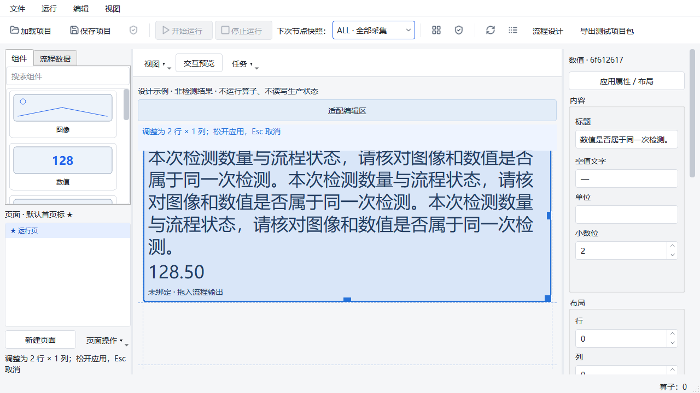
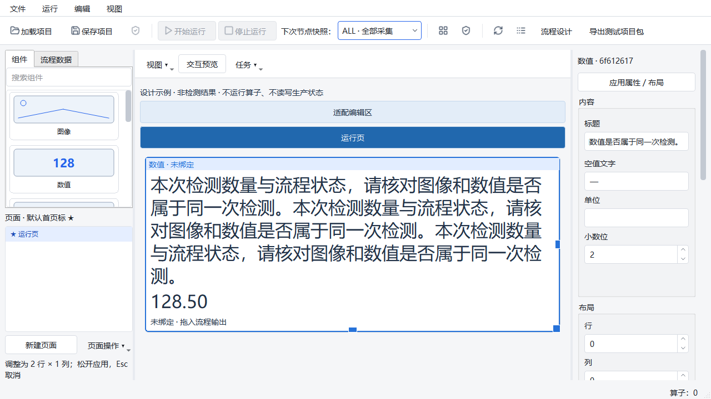
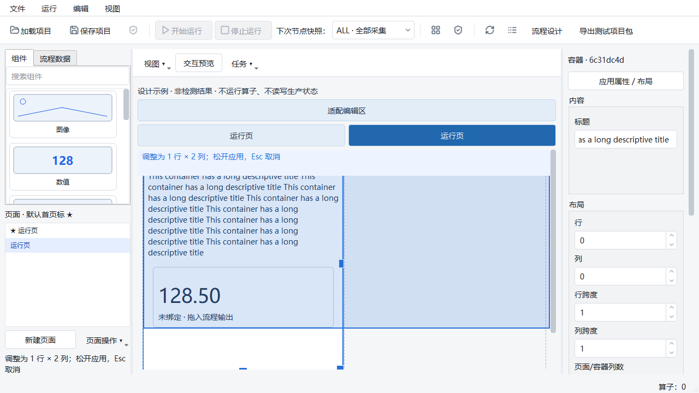
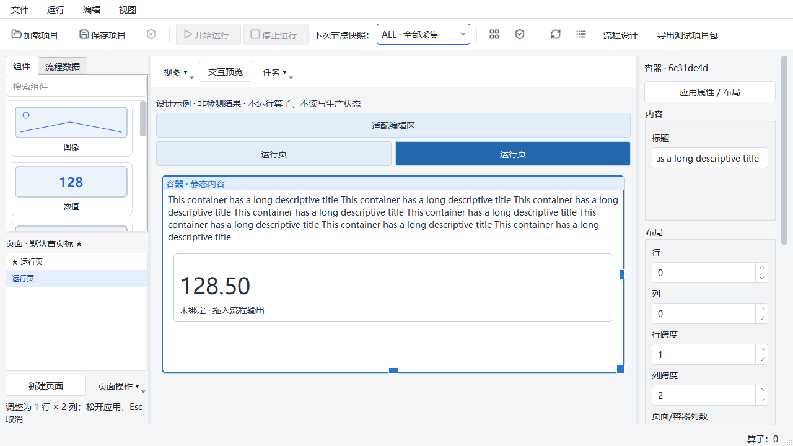

# 页面设计器第二轮尺寸预览修复（2026-10-03）

起点：`agent/runtime-workflow-architecture-v1`，`a75fcf78ddec15b123bdd0fb959bcb923f1f46c1`，开始时工作区干净。
本轮修复两个已复现问题：待提交标题/字号后的连续调整，以及带长标题容器拉宽后的高度预测。
不扩展组件、算子、绑定契约、项目格式、Runtime 或发布能力。

## 修复

- 手柄按下时先校验并提交属性。需要重建画布时，暂时保留原 Selection 和输入手柄，将其转移到
  更新后的组件；在旧画布延迟销毁前完成转移，不调用 processEvents，不增加会话或图片读取。
  随后从最新模型和控件尺寸开始手势，保留鼠标全局轨迹；取消/关闭释放鼠标和键盘抓取。
  已接受的属性是原有表单事务，调整成功另有一条布局事务；取消不产生布局事务。
- 容器标题改为原生 QVBoxLayout 中的 QLabel，子组件保留独立逻辑网格。标题换行由 Qt 的
  heightForWidth 统一计算，不再在 Resize 回调里事后修改顶部边距。预览和正式控件使用相同尺寸契约。
- 拟布局读取实际滚动条 sizeHint，兼容 Designer 样式覆盖平台默认宽度；补上较大字号下的 4 像素误差。
- 完整 offscreen CI 又发现嵌套容器的 QFrame 边框未扣除：多出的 2 像素宽度让长标题少换一行，
  导致预览高度 660、实际 678。改为从 contentsRect 测量内容空间，保留原有 2 像素容差。
- 拖入带标题容器、子组件调整、嵌套容器均继续使用稳定容器 ID。旧非遮挡断言改用同一父坐标系比较，
  子网格 `(0, 0)` 与不遮挡断言均保留，不通过修改容差或删除断言达标。

新增 `tests/ui/page_designer/test_resize_properties.py` 共 10 例：提交/取消/重建/关闭、无效输入、
两种字号和嵌套位置的长标题调整，以及带标题容器的拖入和子组件调整。保留已有 23 例几何/手柄回归。

## 验证隔离与范围

执行过程中发现本轮以外的 `page_designer/palette.py` 和 `tests/ui/page_designer/test_palette.py` 修改。
未覆盖、暂存或纳入本次代码提交。为避免受测状态混入它们，使用本地 shared clone 的 detached
`a75fcf7` 临时副本，仅叠加本轮 7 个源码/测试文件。正式编辑和提交仍在原工作分支，不改 main。

临时验证副本：`manual_test_workspace/page-review-round2-fix-20261003/frozen`。
完整 CI 与最终原生专项都在固定副本运行，分别记录 HEAD、dirty、命令、环境和逐文件 SHA-256。
这验证本次候选，不代表已验收其他尚未提交的组件库修改。

Windows 本机，Python 3.10.21、PySide2 5.15.2.1；未重装依赖、未操作真实设备。

```powershell
$python = 'C:/Users/jsdfhasuh/.conda/envs/emo_master/python.exe'
$env:QT_QPA_PLATFORM = 'windows'
& $python -m pytest tests/ui/page_designer/test_resize_properties.py tests/ui/page_designer/test_grid_geometry.py tests/ui/page_designer/test_canvas_resize.py -q

$env:QT_QPA_PLATFORM = 'offscreen'
$env:HUARAY_CAMERA_SMOKE = '0'
$env:PYTHONPATH = "$PWD/src"
$env:PYTEST_ADDOPTS = '--ignore=manual_test_workspace -ra'
Remove-Item Env:QT_SCALE_FACTOR -ErrorAction SilentlyContinue
Remove-Item Env:PYTHONIOENCODING -ErrorAction SilentlyContinue
& $python scripts/ci_check.py
```

| 检查 | 结果 |
| --- | --- |
| 原审核原生鼠标路径 | 2 FAIL、29 PASS；[失败原始日志](page-editor-2026-10-02/round2-review-baseline.log) |
| 固定副本原生专项 | 33 PASS，14.78 秒；[日志](page-editor-2026-10-02/round2-native.log)／[来源](page-editor-2026-10-02/round2-native-provenance.json) |
| 固定副本截图、连续手势与保存重开 | 1 PASS，2.08 秒；[日志](page-editor-2026-10-02/round2-screens.log) |
| 第一次完整 CI | **1 FAIL、2594 PASS、8 SKIP、26 subtests PASS**，707.36 秒；失败为本轮新增嵌套容器测试，非基线；[日志](page-editor-2026-10-02/round2-ci-first-failure.log)／[来源](page-editor-2026-10-02/round2-ci-first-provenance.json) |
| 边框修复后原生专项 | **33 PASS**，16.29 秒；[日志](page-editor-2026-10-02/round2-native-final.log)／[来源](page-editor-2026-10-02/round2-native-final-provenance.json) |
| 边框修复后截图与保存重开 | **1 PASS**，2.12 秒；[日志](page-editor-2026-10-02/round2-screens-final.log) |
| 边框修复后完整 CI | **2595 PASS、8 SKIP、26 subtests PASS**，pytest 721.36 秒、总计 724.11 秒；proto-drift、Ruff、mypy（295 个源文件）均通过；[日志](page-editor-2026-10-02/round2-ci.log)／[来源](page-editor-2026-10-02/round2-ci-provenance.json) |

8 项 SKIP：6 项需要 Windows 符号链接权限、1 项真实相机显式禁用、1 项仅验证非 Windows 拒绝路径。
它们没有记为 PASS。最终运行无新增失败；首次完整 CI 的新增失败已修复并保留原始记录。
本次 A18 未复现失败，不等同修复之前的原生线程身份问题或 Qt 间歇崩溃。

初版大字号容器测试发现滚动条 4 像素宽差，1 FAIL / 32 PASS；修复实际滚动条尺寸读取后上述
原生专项通过，2 像素允许误差没有放宽。较早运行旧临时探针时，其按外层 layout 第一个子项查找
内容的代码拿到了新标题标签；正式测试改为按稳定组件 ID 获取内容，并保持非遮挡断言。

## 原生效果

以下为明确标注的设计示例，没有 Job。采用实际鼠标按下、全局移动及释放轨迹；不随重建后的手柄位置
挪动合成指针。已保存并重开项目检查配置一致。测量见 [记录](page-editor-2026-10-02/round2-measurements.json)。

- 待提交标题/字号：预览与提交均为 `(9, 9, 748, 317)`，原审核为 128→317 的高度偏差。
- 容器长标题：预览与提交均为 `(9, 9, 748, 320)`，原审核为 734×364→748×304。






本轮不改判既有 A18 原生线程身份失败、Qt 间歇崩溃、长期资源稳态及 1080p/5 Hz/200 ms 性能 FAIL。
没有现场设备、物理多屏、冻结包或现场连续运行验收。参见 [前次修复证据](page-editor-review-fixes-2026-10-02.md)。

## 提交与受测代码核对

- `1ec360f51e594240f98492da1696a103d57f9714`：连续手势、容器标题与滚动条测量修复，新增 10 个测试。
- `d960b84905d33e49d4d49d47fafe8d3350395f27`：完整 CI 暴露的嵌套容器边框测量修复。
- [提交树与固定受测副本核对](page-editor-2026-10-02/round2-commit-verification.json)：比较全部
  616 个 src/tests/scripts Python 文件，规范化 CRLF 后全部一致，并核对运行中源码未变及原始日志复制摘要。
  不把工作区另外两项组件库编辑计入受测或提交状态。
