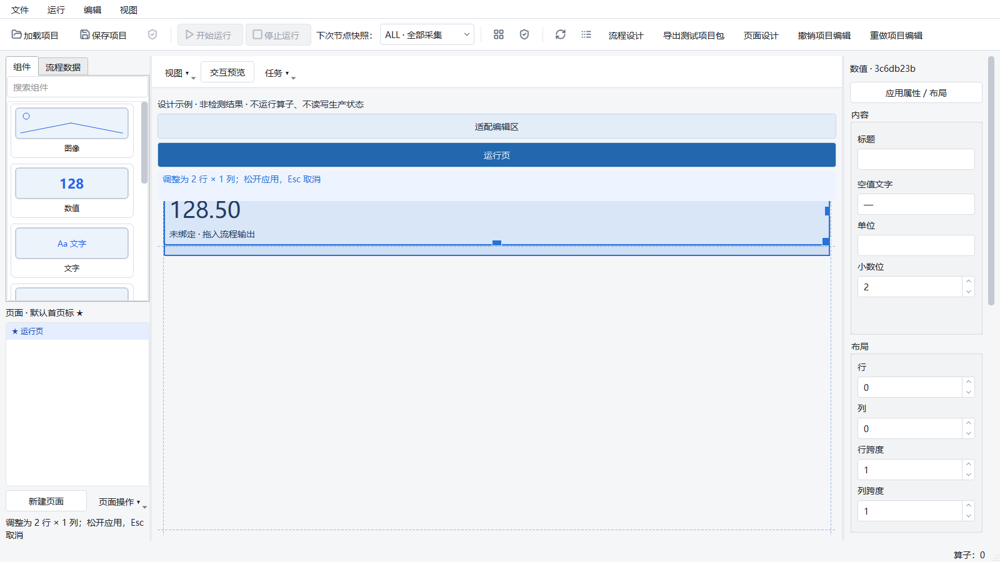
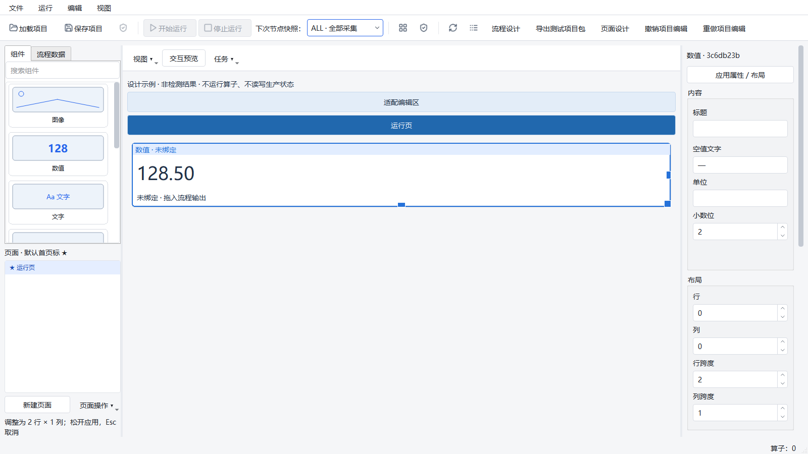
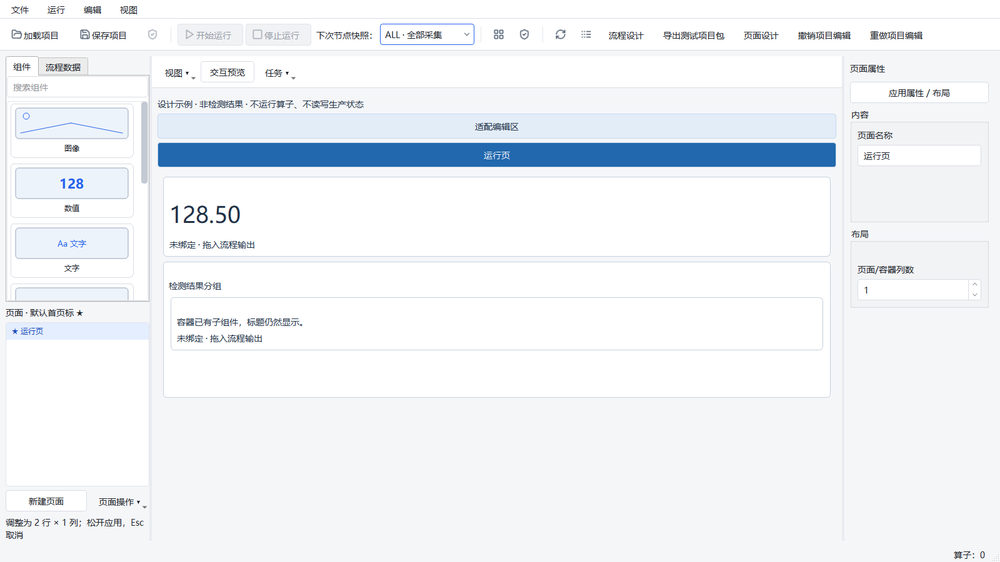

# 页面设计器审核缺陷修复（2026-10-02）

起点：`agent/runtime-workflow-architecture-v1`，`ab45756422c7556353abdf82fbd9c5596442a85d`，工作区干净。
本轮只修复审核复现的三个问题，不扩展算子、执行能力、项目格式或发布流程。

代码与测试提交：`4c2a86df48753a5c4d1f5a04b0c2f2faa216de2f`。
[提交核对](page-editor-2026-10-02/review-fix-commit-verification.json) 确认受测源码未改变、提交内容一致，
归档日志与本机原始日志逐字节相同。证据说明作为后续独立提交，不改写代码提交。

## 缺陷与修复

1. 不等宽列的拖放命中错误。长导航按钮导致实际列宽不相等时，旧代码仍按等分宽度计算，
   鼠标位于第一列的空白区域却将组件保存到第二列。现在命中、列线和横向落点框使用 Qt 的
   `cellRect`，间距以相邻列中线划分，左右越界仍交给原模型拒绝。
2. 调整高度预览与提交不一致。旧代码将剩余空间的 stretch 行纳入预览，原生正式样式下
   预览 568 像素、提交 128 像素。现在使用短生命周期的 `QLayoutItem` 尺寸代理和
   `QGridLayout` 计算拟提交布局，重新计算内容行与末尾 stretch，并考虑根画布滚动条变化。
   不创建 QWidget、第二个渲染器、会话或图像副本，不移动原控件；释放时仍只提交一次项目事务。
   鼠标释放的位置也参加最后一次校验，避免使用上一条移动事件的过期候选。
3. 容器加入子组件后标题消失。标题现在是持续存在的原生纯文本 QLabel，根据宽度换行并保留
   顶部布局空间；编辑器与独立运行窗口共用。不占用子组件的逻辑网格行，不改变保存格式或绑定。

代码位于 `page_designer/{canvas_tools,grid_geometry,tools}.py` 和
`ui/presentation/{renderer,container_title}.py`。原编辑事务、类型约束、数据来源、Runtime 行为未修改。

## 环境与验证

Windows 本机，Python 3.10.21、PySide2 5.15.2.1；复用已有 Conda 环境。未安装依赖、未连接真实设备。
新增 `tests/ui/page_designer/test_grid_geometry.py` 共 15 例，覆盖不等宽列实际提交、边界、
数值/图像/表格的纵向及双向调整、页面与嵌套容器、缩小/取消、单次撤销、标题和保存重开、独立渲染。
没有删除旧断言或降低既有验收目标。

```powershell
$python = 'C:/Users/jsdfhasuh/.conda/envs/emo_master/python.exe'
$env:QT_QPA_PLATFORM = 'windows'
$env:QT_SCALE_FACTOR = '1'
& $python -m pytest tests/ui/page_designer/test_grid_geometry.py tests/ui/page_designer/test_canvas_resize.py -q

$env:QT_QPA_PLATFORM = 'offscreen'
$env:HUARAY_CAMERA_SMOKE = '0'
$env:PYTHONPATH = "$PWD/src"
$env:PYTEST_ADDOPTS = '--ignore=manual_test_workspace -ra'
Remove-Item Env:QT_SCALE_FACTOR -ErrorAction SilentlyContinue
Remove-Item Env:PYTHONIOENCODING -ErrorAction SilentlyContinue
& $python scripts/ci_check.py
```

`--ignore` 仅排除本机临时目录里的旧检出与审核探针，不跳过正式 tests。
完整 CI 使用 1200 秒外层 watchdog，不修改单任务/测试期限。

| 验证 | 实际结果 |
| --- | --- |
| 修复前正式样式审核探针 | 3 FAIL / 1 PASS；[原始证据](page-editor-2026-10-02/review-baseline-defects.log) |
| 页面几何、调整、可视化、待提交表单、真实用户路径、共享组件 | 47 PASS，10.13 秒；当时新增几何模块 14 例，之后补缩小/取消第 15 例 |
| 最终原生 Windows：15 例新回归＋8 例旧调整＋1 例截图/保存路径 | 24 PASS，12.02 秒；[原始日志](page-editor-2026-10-02/review-fix-native.log) |
| 完整 CI | **FAIL：2584 PASS、1 FAIL、8 SKIP、26 subtests PASS**，pytest 657.79 秒；proto drift、Ruff、mypy 均 PASS；[原始日志](page-editor-2026-10-02/review-fix-ci.log) |

完整检查在 `ab457564…` + 本轮 dirty 候选上运行，[来源记录及源码摘要](page-editor-2026-10-02/review-fix-provenance.json)
包含实际命令、环境、dirty 清单和逐文件 SHA-256，`changedDuringRun=[]`，不将它冒称为干净新提交上运行。
唯一失败仍是原 A18 `testThousandNavigationsAndThirtyFloatingCyclesRetireNativeOwners`：
`navigation index=399`，native_threads 63→65、handles 2510→2510，新 native thread IDs 为 38980、57736。
与之前的失败模式一致，但来源与长期稳态仍未解决，不判定无害、不豁免。
8 个跳过项为 6 个 Windows 符号链接权限限制、1 个真实相机 smoke 未启用和 1 个非 Windows 专用分支。
跳过不计通过。新增 15 例在本轮完整 CI 中全部通过。

开发过程中两次失败保留在本次工具输出：一次将横向跨度手势改为列边界吸附，导致 offscreen
极窄布局下原用例 2 FAIL；撤回该无关手势改动，跨度语义保留。另一次新断言发现图像跨列后
滚动条消失引起 14 像素误差，修复拟布局的滚动条计算后通过；没有放宽 2 像素几何断言。

## 原生窗口证据

以下为 Windows 原生 QWidget 与正式 Designer 样式截图，使用明确标注的设计示例，无 Job。
鼠标调整通过 QTest 事件，实测预览与提交矩形均为 `(9, 9, 1068, 128)`，保存重开一致，
见 [测量记录](page-editor-2026-10-02/review-fix-screens.json)。





原始本机材料位于 `manual_test_workspace/page-review-fix-20261002/`；审核失败材料仍保留在
`manual_test_workspace/page-review-20261002/`。后续通过不覆盖原失败记录。

## 未解决边界

此修复不代表全部组件和任意算子输出均已支持，也不代表长期资源稳态、原 1080p/5 Hz/200 ms
性能或现场发布通过。原 A18 native thread 身份失败、Qt 间歇崩溃及既有性能 FAIL 保留，
见 [前次完整报告](page-editor-2026-10-02.md)。真实设备、目标工控机、冻结包和现场连续运行未执行。
