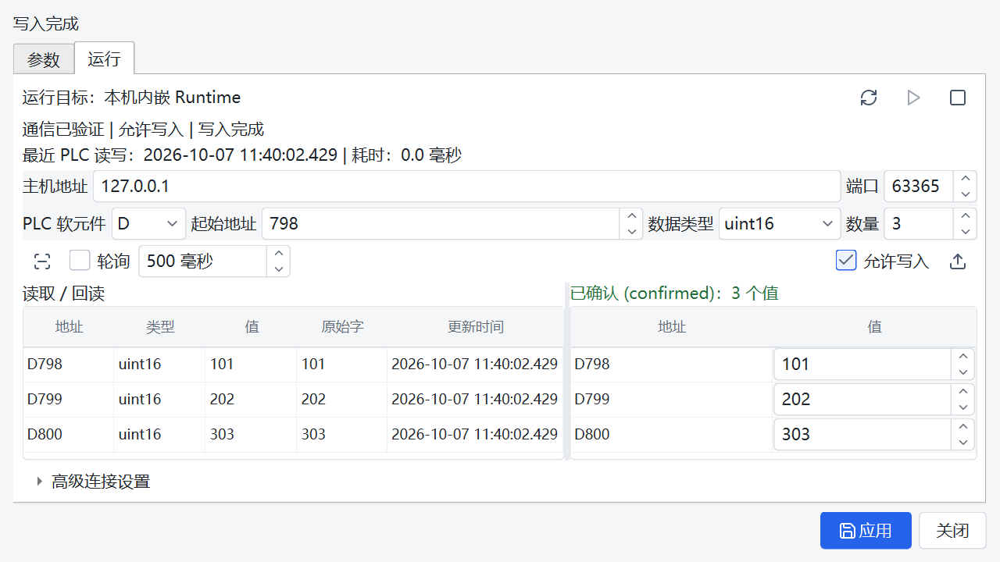
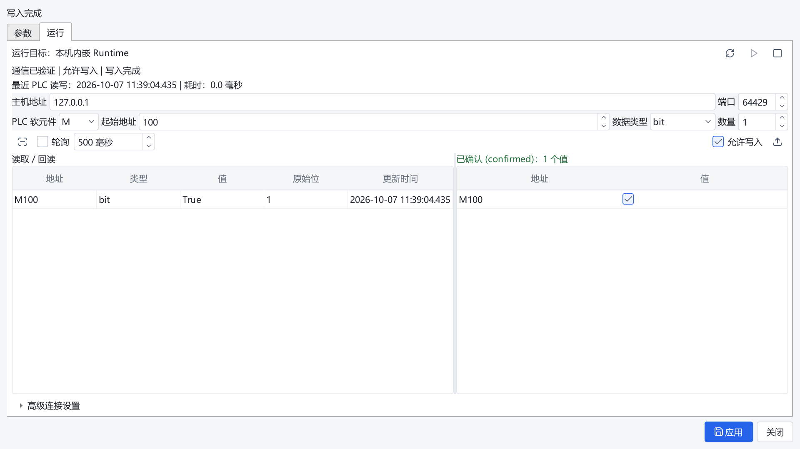

# PLC Debug Editor Validation

This change adds the Parameters / Runtime tabs to both built-in SLMP operators.
Debug values are temporary and independent of workflow parameters. Applying
parameters does not connect to a PLC or issue a command.

The existing plugin registry, workflow ports and communication payload contracts
are retained. The two plugin manifests select a shared custom editor; its exact
controller entry is registered in the existing built-in trust allowlist.

## Runtime Behavior

- PLC access runs on the selected Runtime through three additive debug RPCs.
- A session explicitly opens one persistent TCP connection, starts write-locked,
  expires after 30 seconds without renewal and renews every 10 seconds.
- Native SLMP bit-unit commands access M bits without changing neighboring bits.
  Existing workflow word-unit behavior remains separate.
- The Runtime validates values and address spans, serializes data commands,
  deduplicates writes and never automatically retries a debug write.
- Permission generations fence old unlock requests and queued/delayed writes
  after a newer lock request. Enabled writes include the captured lockGeneration;
  completed duplicate requests retain their original receipt after a lock change.
- Lost write acknowledgements produce an unknown outcome. A confirmed write and
  failed readback remain separate outcomes; readback failure does not undo writing.
- Closing, project changes and job admission invalidate session ownership before
  waiting for release. Terminal status alone does not prove worker retirement.
- Draft PLC nodes/workflows may debug within the loaded project without saving
  or reloading the workflow. Only registered, allowlisted PLC operators may open.
- Old Runtimes retain parameter editing and explicitly reject unsupported debug.
- Page changes and manual locking pause polling and cancel pending writes, while
  allowing dispatched data operations to finish on the retained connection.
  Closing, disconnecting, reloading and invalidating sources still cancel I/O.
- A late control reply cannot downgrade a verified live connection to TCP-only
  status. A new connection starts unverified and write-locked.

## Reproduction

Use the existing Python 3.10 `emo_master` environment. The verification script
starts only an independent loopback SLMP simulator and temporary Runtime state.
It never starts a Job or accesses PLC hardware.

```powershell
$env:PYTHONUTF8 = '1'
$env:PYTEST_ADDOPTS = '--ignore=manual_test_workspace'
& "$env:USERPROFILE/.conda/envs/emo_master/python.exe" scripts/ci_check.py
$env:QT_SCALE_FACTOR = '1.5'
& "$env:USERPROFILE/.conda/envs/emo_master/python.exe" scripts/validate_plc_editor.py --platform windows --output docs/testing/plc-debug-2026-10-07/new-native-150
$env:QT_FONT_DPI = '96'
& "$env:USERPROFILE/.conda/envs/emo_master/python.exe" scripts/validate_plc_editor.py --platform offscreen --output docs/testing/plc-debug-2026-10-07/new-offscreen-150
```

The output directory must be new. Each report records requested/effective geometry,
device pixel ratio, screen constraints, simulation traffic and screenshots.
Native 1920x1080 requests are constrained by the current display's title bar,
taskbar and available work area; exact larger viewports are checked offscreen.
Screen-constrained cases must not be represented as exact full-screen acceptance.
Offscreen captures use a 96 DPI base to produce the intended 1.25/1.5 device
pixel ratios. Physical screenshot sizes are recorded, with at most one pixel of
integer rounding at scaled viewports. Native captures retain the desktop DPI.
Windows offscreen Qt does not enumerate system fonts. The script explicitly
loads the installed Microsoft YaHei font when the font database is empty, before
applying the existing Designer theme. Every final report records the font family
and a successful text rasterization probe; native rendering uses its normal
system font database.

## Retained Intermediate Evidence

- `ci-final.txt`: the first unscoped pytest collection encountered 52 import
  conflicts from pre-existing ignored `manual_test_workspace` copies. No test
  outcome was established; those copies were retained.
- `ci-tests-scope.txt`: the complete authored `tests` suite progressed without
  failures before being explicitly stopped at 46 percent after review identified
  two additional permission/lease races. This superseded run is **INTERRUPTED**,
  not passing evidence. The final gate follows the last fixes below.
- Earlier non-final capture directories retain failed QA-helper/layout attempts
  and repaired intermediate checks. Only the final reports listed below establish
  acceptance of the delivered source. All capture attempts used loopback peers.
- `verified-offscreen-125` and `verified-offscreen-150` recorded passing geometry
  checks, but visual review found missing text because offscreen Qt had no fonts.
  These reports and earlier offscreen reports are superseded and do not establish
  visual acceptance. The final `verified-font-*` matrix includes rendered text.
- `editor-final-fixed-layout.txt` retains compact-window failures from an
  intermediate selector-scroll minimum height and a test comparing coordinates
  from different parents. The final minimum is 24 logical pixels and the test
  compares positions in the common Runtime-page coordinate system.
- `backend-final.txt`: an intermediate combined run recorded 440 passes and 44
  fixture errors while another task changed operator schemas and manifests during
  the process. A fresh coherent snapshot passed all 147 transport and 337 Runtime
  cases together (484 passes); fixture diagnostics now retain registry failures.
  No registry bypass, retry, schema rollback or weakened assertion was added.

## Delivered Source Verification

The baseline Git HEAD is `6aa57f3e21fd207a65047f532feb92a3b82de1ae`.
The tested candidate includes uncommitted PLC edits and concurrent parameter-title
changes. Those unrelated changes were preserved. `ci-delivery-source-before.json`
records 713 source/proto/test hashes for the full CI snapshot. The final
`source-verified.json` records 715 hashes, including two concurrent, untracked
parameter-title test files. Each final capture report records the original 713
keys and verifies that they do not change during capture. The comparison in
`source-verified-comparison.json` confirms every final report matches the final
ledger on all recorded keys. These hashes, rather than the baseline HEAD alone,
identify the candidate.

The complete CI gate in `ci-delivery.txt` passed proto drift, Ruff, Mypy and the
full authored pytest collection: **3627 passed, 8 skipped, 28 subtests passed**
in 979.70 seconds. Only the pre-existing ignored `manual_test_workspace` copies
were excluded from collection. Skips are retained as skips.

The following changes followed that full CI snapshot: the PLC Controller now
keeps connection status, recent PLC read/write time and elapsed time at the top,
preserves that metadata across permission/lease replies, and keeps the command
buttons outside the selector scroll area. The viewport QA assertions and font
initialization were strengthened. The PLC Qt tests were updated accordingly;
the operator registration tests now retain scan diagnostics without weakening
their assertions. The full suite was not rerun after these UI refinements.

Checks on the delivered implementation:

- Transport and Runtime together: **484 passed** (147 transport + 337 Runtime),
  with a fresh final run recorded in `backend-verified.txt`.
- Editor/Manager/parameter-form/title/registration combined regression:
  **133 passed**, recorded in `editor-verified.txt`. This includes both operators,
  embedded Runtime/socket lifecycle cases, permission fencing and late replies.
- The focused final layout and metadata checks also passed: **21 passed,
  92 deselected**, recorded in `editor-layout-current.txt`.
- Existing communication operators, Runtime workflows and live preview:
  **49 passed**, recorded in `communication-regression-final.txt`.
- Final proto drift, Ruff (including the capture script) and Mypy checks passed,
  recorded in `static-verified-font.txt`; Mypy checked 336 source files.

Final capture matrix: **70 cases passed**, both operators. Every report records
two loopback connections, ten SLMP requests, unchanged M99/M101 neighbors when
writing M100, rendered text and no remaining Runtime jobs or debug sessions.
The matrix covers D/M results, parameters and advanced connection controls.
Control containment checks also verify that controls in the selector scroll
area are inside its viewport, rather than merely inside the outer window.

| Report Directory | DPR | Cases | Small Client | Large Client |
| --- | --- | --- | --- | --- |
| `verified-font-native-100` | 1.0 | 14 | 1280x720 | 1902x984, screen constrained |
| `verified-font-native-125` | 1.25 | 14 | 1280x720 | 1898x980, screen constrained |
| `verified-font-native-150` | 1.5 | 14 | 1280x720 | 1893x975, screen constrained |
| `verified-font-offscreen-125` | 1.25 | 14 | 1280x720 | 1920x1080 |
| `verified-font-offscreen-150` | 1.5 | 14 | 1280x720 | 1920x1080 |

Visual review confirmed text, connection/command visibility and table layout
in the final native 150% 1280x720 D view and the exact offscreen 150% 1920x1080
M view. Individual reports contain all screenshots and effective geometry.





## Acceptance Boundaries

Real PLC acceptance: **NOT_RUN**. No approved hardware endpoint or write range
was supplied. Simulation does not establish real-device, cycle-time or field
acceptance. Packaging, external build and publication: **NOT_RUN**.

Restart a source Designer to load the new editor. A remote Runtime must run the
updated source/protobuf handlers to support debugging; an older Runtime still
supports the parameter page and reports that debug commands are unsupported.

Native hostname resolution cannot terminate an OS `getaddrinfo()` call already
in progress. Two bounded daemon resolver workers isolate those calls; waits
observe cancellation/connect deadlines, late results cannot open connections,
and numeric IP addresses bypass the resolver pool.
