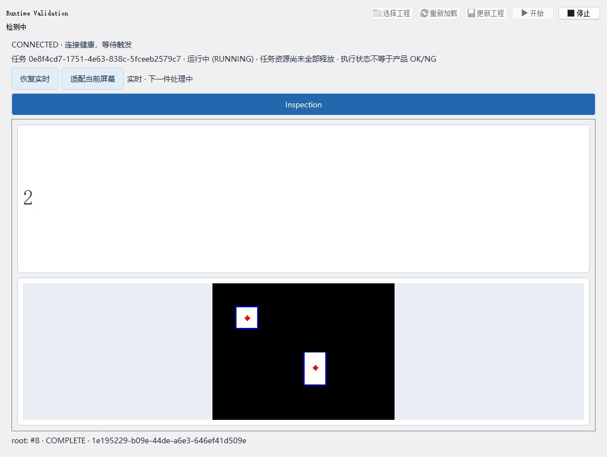

# Runtime 冻结与工程交付验证

## 验证范围

2026-10-06 继续独立 Runtime 计划 D4-D6，实现集中 Actions 打包接入、生产工程包和停机更新，并执行本地冻结/合成测量。夹具是固定的两块白色区域和页面计数，不使用用户工程、私有模型、相机或 PLC。

- 应用工作区：`C:/Users/jsdfhasuh/my_scripts/emo_master`，实目录为 `D:/jsdfhasuh/documents/my_project/emo_master`。
- 应用参考 HEAD：`9737f04312a2803f824e4bbeab6ea845549edaf7`；验证包含未提交 Runtime 实现和原有 Designer 修改，不是 clean HEAD。
- 集中打包仓：`D:/jsdfhasuh/documents/my_project/python_build_script`，参考 HEAD `fe4921772287cb5d2f5946283f5a4122f5067f89`，新增目标 `emo-master-runtime`。
- 基础解释器：`C:/Users/jsdfhasuh/.conda/envs/emo_master/python.exe`，Python 3.10；PyInstaller 6.22.2、Pillow 11.3.0 等构建/测试依赖安装在工作区独立 venv，未修改基础 Conda 环境。
- 未提交、推送、创建 tag、执行云端 Action、上传 Release、安装到现场或操作真实设备。

## 代码与回归

| 验证 | 结果 | 边界 |
| --- | --- | --- |
| Runtime、core、operator_view 与冻结入口相关大回归 | 1272 passed、1 skipped，404.72 秒 | 不含整个 Designer；在最后的验收驱动修正之前执行 |
| 最终工程包、窗口更新、连续执行、自测入口回归 | 32 passed，47.19 秒 | 包含最终 Qt 延迟删除处理、启动状态同步和自测重启补测 |
| 操作员窗口专项 | 8 passed，16.19 秒 | 更新保留现场历史、应用新 autoStart、运行中拒绝更新 |
| 集中打包仓全量 unittest | Ran 365 tests，OK，skipped=1，333.269 秒 | 夹具/单元验证，不是云端或生产发布；最终退出码清理接点另经实际本地打包验证 |
| 集中目标、provenance、Actions、默认构建专项 | 3、5、41、8 项，均 OK | 默认 Designer/其他目标语义未改，公开发布 guard 保留 |
| Proto、Ruff、Mypy、PowerShell 解析、diff 检查 | PASS，Mypy 331 源文件 | Ruff 使用仓库的 src/tests 范围并检查新增脚本；不宣称严格检查所有未标注函数体 |

首轮相关大回归的两项失败已修正：源码导入检查子进程没有明确 `PYTHONPATH`，以及旧按钮列表未包含“更新工程”。没有移除无 Designer、无任务执行或按钮权限断言。D1-D3 的仓库全量曾有 Designer 工具栏失败和计数器时序风险，见 [历史源码记录](standalone-runtime-2026-10-06.md)；这次没有重新执行整个仓库全量，不能宣称整体 CI 全绿。

## 本地冻结与 ZIP

使用集中仓现有 `build.py` 和新目标配置 clean build，生成：

```text
D:/jsdfhasuh/documents/my_project/python_build_script/dist/EmoMasterRuntime/EmoMasterRuntime.exe
C:/Users/jsdfhasuh/my_scripts/emo_master/manual_test_workspace/runtime-actions-20261006/final-delivery/emo-master-runtime-windows-v0.6.1.zip
```

ZIP 使用 deflate，保留整个 onedir 目录及 `_internal`。集中发布脚本以 `-BuildOnly -SkipBuild` 验证刚由 `build.py` 重建的目录，再生成 ZIP 和 manifest；SkipBuild 仅用于本地重复校验，公开发布仍禁止复用未证明来源的 dist。

冻结 gate 清空 `PYTHONPATH`、`PYTHONHOME`，将 `PATH` 限制为 Windows/system 目录，从仓库外新工作目录启动 EXE。然后从便携 ZIP 解压到新的临时目录，重复同一验收。两次都要求：

- `frozen=true`、零 Designer 模块导入，50 个内置算子和 4 个 SQL 迁移可读取。
- CPU ONNX 小模型推理通过；这不是生产模型准确率或性能验收。
- 合成工程导出为 `.vxpkg`，安装到另一个目录后运行；模型/文件输入不依赖开发路径。
- 真实 spawn worker、同一任务多周期、页面计数 2、160x120 图像和非空像素、正式输出文件存在。
- 三个会话均正常 `E_CANCELLED`，worker 所有权释放，窗口关闭后 Runtime 完成关闭。

最终产物、源文件增量及报告哈希见 [candidate.json](runtime-delivery-2026-10-06/candidate.json)，冻结 gate 见 [frozen.json](runtime-delivery-2026-10-06/frozen.json)，ZIP 解压验收见 [archive.json](runtime-delivery-2026-10-06/archive.json)。本地 legacy manifest 的 `source_commit` 只是参考 HEAD，并不证明包含未提交改动；其下载 URL 也不意味着已上传。不能把这个本地候选包当作正式公开 Release。

最终 ZIP 大小 126469515 字节，SHA256 为 `410090957114d03d740f1a487bd683fc491206df9894cb44fff897aa3590e79b`；EXE SHA256 为 `25e3ef6d221a4f2b4698925df440e39f50c8ae58b1d90c66bf96f2bf949dc101`。

## 工程包和更新

12 个工程包用例及窗口更新用例覆盖：外部文件输入收集、设备/输出/页面/策略保留、原工程不改写、目录移动后真实检测、同根重载保持所有权、运行中拒绝更新、不同项目使用新目录、旧输入缺失修复、历史输出/本地文件保留、普通写入失败恢复、路径穿越/大小写别名/哈希变化/未声明文件/算子版本不匹配拒绝。

工程更新先在旁边暂存并完整验证，再替换配置/输入资源，配置最后发布；被替换文件保留在 `.runtime-backup-<id>`。正常异常恢复通过，不承诺整目录原子更新。中断/断电恢复、磁盘耗尽及实际现场更新仍为 NOT_RUN。

## 连续运行测量

最终冻结候选使用原生 Windows Qt，首会话测量 60 秒，然后重复开始/停止 10 次，共 11 个会话。完整退出码必须为 0；每个会话至少观测四次完成、身份不重复、页面图像正确、正常取消且 worker 退休，终态诊断不超过配置的 500 条。

命令：

```powershell
python scripts/validate_operator_runtime.py `
  --executable D:\jsdfhasuh\documents\my_project\python_build_script\dist\EmoMasterRuntime\EmoMasterRuntime.exe `
  --output manual_test_workspace\runtime-actions-20261006\frozen-native-complete `
  --duration 60 --restarts 10 --qt-platform windows
```

原始采样记录 owner/worker RSS、句柄、CPU 时间和采样异常，不给缺失值填零。观测的完成事件不是正式产量分母或节拍验收；开发机同时还有验证任务，不可用于推断目标机性能。报告将 `resourceAcceptance` 和 `fieldAcceptance` 明确设为 NOT_RUN。最终报告和运行中截图见 [native.json](runtime-delivery-2026-10-06/native.json)、[measurement.json](runtime-delivery-2026-10-06/measurement.json)。

最终结果为 **PASS（合成功能短测）**：首会话观测 96 次完成，其后十个会话各至少 4 次，11 次停止全部 E_CANCELLED。采样共 266 次，其中 36 次保留了进程退出附近的采样错误；首会话 owner 句柄首末均为 859，RSS 约 180.5 到 183.9 MiB。跨会话仍有 RSS/句柄波动，不能据此证明长期无增长，更未按实际工况的稳态预算判定。



调查和修正记录：

- 初次连续自测的诊断队列无界，SQLite 消费慢时 feeder backlog 积累并影响正常停止；连续任务改为容量 64，以背压控制，不丢业务输出和计数。强制停机超时保留 FAULT，不当作正常停止。
- 首份短测中句柄随重启增长。自测驱动手动 `processEvents`，补上 Qt DeferredDelete 处理，使资源采样不被尚未处理的 Qt 删除事件污染；正式 GUI 仍使用原有 `app.exec_()`，没有改造生产事件循环。
- 一次源代码复测在第九次会话触发状态断言，日志/数据库只有正常 E_CANCELLED。自测增加真实 RUNNING 记录等待，避免页面结果流先于 durable job.started 到达时误判，并保留启动期限和运行中非 RUNNING 的失败检查。
- 失败记录及原始短测保留在 `manual_test_workspace/runtime-actions-20261006`，没有删除或覆盖；最终报告使用新的目录，非失败自动重跑私有工程。

## 剩余验收

| 项目 | 状态 |
| --- | --- |
| GitHub Actions 云端构建/下载 | NOT_RUN；两仓新实现需先存在于已推送提交，调用时明确 source_ref/packager_ref；应用新工作流的手动按钮需进入默认分支，之前可用集中仓现有工作流并显式 Publish assets=false |
| 未安装开发工具的干净 Windows 机器 | NOT_RUN；当前是开发机隔离搜索路径和新目录验证 |
| 用户工程、生产 ONNX 模型、相机/PLC、触发/输出准确性 | NOT_RUN |
| 目标负载长期资源稳态、节拍和完整输入/结果分母 | NOT_RUN；尚无实际工程和预算 |
| 设备断线恢复、真实磁盘耗尽、更新中断/物理断电恢复 | NOT_RUN |
| 公开发布、现场安装和正式长期生产签收 | NOT_RUN |

软件功能和本地打包验证已交付；D6 现场部分不因短测通过而自动完成。
