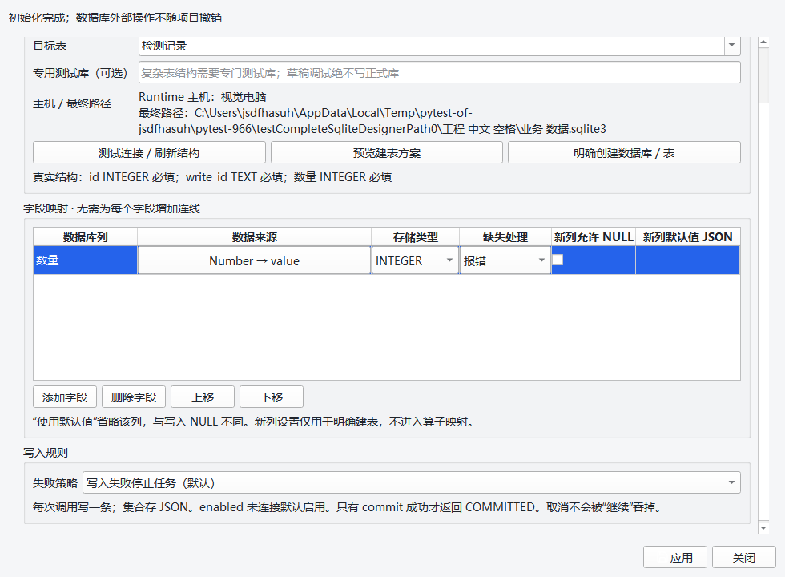
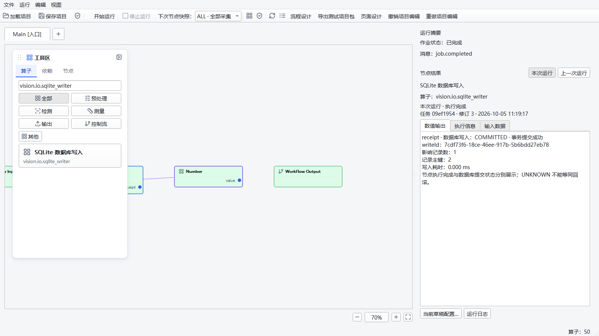
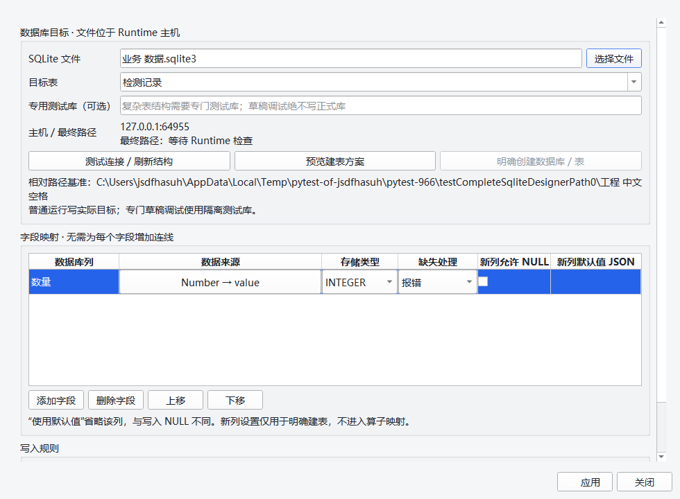

# SQLite 写入算子实施与验证（2026-10-05）

正式算子 `vision.io.sqlite_writer`、显式字段映射依赖、SQLite 管理 RPC/事务后端、
草稿调试隔离和原生配置窗口已进入正式模块。真实 Designer 路径完成了“拖入 → 双击 →
选择来源 → 增减映射 → 只读检查 → 预览 SQL → 明确初始化 → 应用 → 两次运行 →
查看回执 → 查询数据库 → 保存重开”，没有手改示例 JSON 来代替操作。
本轮不扩展其它数据库、迁移、BLOB、长期查询页、交付包支持或现场发布。

## 提交、工作区和证据身份

- 分支：`agent/runtime-workflow-architecture-v1`。
- 起始 HEAD：`c5c61a9a88e7b3d0f098975e90977e2937ca0e72`。
- A：`4dbcd1fe8b1b1d01a058b32f16d9dede8f49d89f`，配置契约、编译依赖和真实 Runner 投递。
- B：`00004554759b5e339bd91f4e71100cec2059bf66`，受限管理、事务、RPC、冻结和调试隔离。
- C 的功能/测试/本报告随第三批提交；该提交完整 SHA 和最终远端 SHA 见交付消息，
  不把受测父 HEAD 当成已经包含 dirty 代码的提交。

原来 160 个 dirty/未跟踪文件在仓库外逐文件备份，并保存、验证 Git bundle：
`D:/jsdfhasuh/documents/emo-master-backups/sqlite-writer-20261005-092443-038925/`。
本任务不重写历史、不 reset/stash、不改 main、不关闭证书检查。MainWindow 原有 UI 修改
只留在工作区，本任务 39 行新增接点单独暂存；其它原有页面/UI 文件不进入本轮提交。
最终逐文件核对：原 160 个文件中，159 个与备份字节相同；MainWindow 仅叠加本任务接点，
保留原 UI 内容。工作区因此仍有用户原来的未提交修改，不能称为全部干净或全部已上传。

证据目录 [sqlite-writer-2026-10-05](sqlite-writer-2026-10-05/) 保留所有初轮原始结果，
每个新增验证目录拒绝覆盖，包含 command/exitCode、真实 HEAD、完整 dirty、逐文件
SHA-256、源码摘要、解释器及依赖版本。原基线在 A 改动之前运行，raw.log 和 dirty.txt
保留，原文件与 Git 对象可通过仓库外备份核对。

| 受测候选 | HEAD | src/tests/proto/scripts 摘要 |
| --- | --- | --- |
| A a-second | c5c61a9 | 22e6045649319472614920b21ea3c3fc34bce832406bf50f08cbf72c6bedcef5 |
| B b-reviewed-final | 4dbcd1f | 31aed0acf067cb4a11e776ec7ad2f2bf3957578d545d560cb6c4b29d81b3e17c |
| C c-eighth | 0000455 + dirty | b8b7001e179733486e0f4f8e92f4d960b12726a1e3361a503796233ec5518807 |
| C 回归、原生矩阵、ci-final | 0000455 + dirty | f73efb4441c0eab7cae7f5415199d18c12a566a61b74acf65e1029e5e0cee86d |
| C 最终专项和完整 CI：c-verified / ci-verified | 0000455 + dirty | fc6424f37f441f62d963b05406d34fcce2c2e54a285df569661b6a4a6ce5d00a |
| 排除原 UI dirty 的独立候选：clean-verified / native-clean-verified | 父 HEAD 0000455，index tree 见下文 | 4d63ca7d7b5def56df95ec02877b5a567d4b60e839845170299edc47eef89549 |

`c-eighth` 与回归候选的差异是验证脚本新增了受影响回归套件；此后最终候选还包含
旧 ViewModel 兼容、版本门槛夹具和独立候选发现的问题修正，不能混用它们的摘要。
完整 CI 使用真实 dirty 工作区。另用 `git write-tree` / `git archive` 导出仅含已提交及
本任务暂存源码的树 `8ad183489ec7666ffcf3c44f9de8c2196cd0bc2f`，在仓库外执行全部
SQLite 专项及可见 Qt 路径，不依赖原 UI dirty。该树号是在加入最终报告/证据前记录，
后续只增加文档与证据；提交前核对其生产、协议、脚本和测试源码与 index 一致。
独立候选没有重复完整 CI，也不是冻结构建或跨机/现场验收。

## 环境与命令

Windows 11 build 26200（platform 字符串 `Windows-10-10.0.26200-SP0`）；
Python 3.10.21 x64 / Anaconda，SQLite 3.53.4；PySide2 5.15.2.1、grpcio 1.78.0、
protobuf 6.33.6、NumPy 1.26.4、OpenCV 4.10.0.84。使用已有环境，没有安装或升级依赖。

```powershell
Set-Location 'D:\jsdfhasuh\documents\my_project\emo_master'
$py = "$env:USERPROFILE\.conda\envs\emo_master\python.exe"
& $py scripts/sqlite_writer_validate.py --phase a --output "manual_test_workspace/sqlite-a-$(Get-Date -Format yyyyMMdd-HHmmss)"
& $py scripts/sqlite_writer_validate.py --phase b --output "manual_test_workspace/sqlite-b-$(Get-Date -Format yyyyMMdd-HHmmss)"
& $py scripts/sqlite_writer_validate.py --phase c --output "manual_test_workspace/sqlite-c-$(Get-Date -Format yyyyMMdd-HHmmss)"
& $py scripts/sqlite_writer_validate.py --phase c-regression --output "manual_test_workspace/sqlite-regression-$(Get-Date -Format yyyyMMdd-HHmmss)"
& $py scripts/sqlite_writer_validate.py --phase ci-compat --output "manual_test_workspace/sqlite-compat-$(Get-Date -Format yyyyMMdd-HHmmss)"
& $py scripts/sqlite_writer_ui_validate.py --scale 1 --output "manual_test_workspace/sqlite-native-$(Get-Date -Format yyyyMMdd-HHmmss)"
& $py scripts/sqlite_writer_validate.py --phase ci --output "manual_test_workspace/sqlite-ci-$(Get-Date -Format yyyyMMdd-HHmmss)"
```

`--scale` 还支持 1.25/1.5/2。UI 脚本先创建可见 Windows QApplication，使用 QTest
真实控件、正式 loopback gRPC 及 spawn Job；拖动通过真实卡片产生 MIME 并派送 Qt
拖放事件，不伪造节点配置。外层 watchdog 180 秒只清理新建测试进程树，不放宽 SQLite
单操作 5 秒和锁等待 2 秒。专项/CI 设置 offscreen、PYTHONUTF8、源码 PYTHONPATH、
禁用真实相机 smoke、忽略 manual_test_workspace；实际环境保留在 candidate.json。

CI 脚本真正尝试 `python scripts/ci_check.py` 的 proto drift、Ruff(src/tests)、mypy 和全量
pytest，没有删断言或把 skip 算成 PASS。

## 结果与保留的失败

| 检查 | 状态 | 实际结果/证据 |
| --- | --- | --- |
| 改动前完整 CI | FAIL | 2737 passed、1 failed、8 skipped、28 subtests，701.71 秒；baseline/raw.log |
| A 最后专项 | PASS | a-second：64 passed，4.19 秒 pytest |
| B 最后专项 | PASS | b-reviewed-final：59 passed，28.14 秒 pytest |
| C 较早候选专项 | PASS | c-eighth：84 passed，32.17 秒 pytest；保留历史结果 |
| C 最终专项 | PASS | c-verified：86 passed，33.44 秒 pytest |
| 受影响回归 | PASS | c-regression：71 passed，9.09 秒 pytest |
| 兼容性修正专项 | PASS | ci-compat：25 passed，3.26 秒 pytest |
| 排除原 UI dirty 的独立候选 | PASS | clean-verified：74 passed，29.92 秒；native-clean-verified：1 passed，5.23 秒 |
| 未提交辅助方法清理后的配置回归 | PASS | post-cleanup：4 passed，5.92 秒；第三批正式源码未改变 |
| Windows 可见 Qt 100/125/150/200% | PASS（功能） | native-final-1 / 1.25 / 1.5 / 2，各 1 passed；每次两次实际写入并保存重开 |
| 首次修改后完整 CI | FAIL | ci-final：2789 passed、21 failed、8 skipped、28 subtests，739.05 秒；见下面的归因 |
| 中途取消的两次 CI | NOT_RUN（剩余部分） | ci-post-review / ci-final-reviewed 保留 partial raw.log 和 aborted.json；不当作完整 CI |
| 最终修改后完整 CI | FAIL（原基线） | ci-verified：2811 passed、1 failed、8 skipped、28 subtests，744.10 秒 pytest；完整命令墙钟 746.453 秒 |
| 最终协议生成/Ruff/mypy | PASS | ci-verified，mypy 检查 324 个 source files；全量命令因 pytest 基线失败退出 1 |
| 原 A18/1080p 5 Hz/资源稳态/Qt 组合崩溃 | 原状态保持 | 本轮不改判，不用本次单算子功能演示替代性能验收 |
| 真实设备、远程主机/跨机、冻结 EXE、现场发布 | NOT_RUN | 未操作设备/现场库，也未构建发布包 |

基线失败是 `tests/designer/test_visual_layout.py::testNarrowToolbarKeepsRunActionAndHasOverflow`
的 `window.startButton.isVisible()`；本轮保留该断言和原始证据。
最终 `ci-verified` 只有同一项失败，没有新增失败；8 个 SKIP 保持跳过，不算 PASS。
首次 `ci-final` 的另外 20 个失败已定位：1 个是新画布代码直接访问旧 ViewModel 的
operatorId（用 getattr 保持兼容）；19 个是通用内置算子测试仍用 coreVersion 0.4.0
扫描所有当前算子，新算子正确要求最低 0.6.1。夹具改用正式 `emo_master.__version__`，
保留原运行断言，另测旧 core 明确拒绝 SQLite、仍加载其它旧算子；未降低版本门槛。

初轮失败也保留：a-first 13 FAIL/51 PASS，b-first 2 FAIL/45 PASS，b-second 1 FAIL/50 PASS；
修正夹具后继续运行，没有覆盖结果。C c-first/c-second/c-third/c-fourth 各 1 FAIL/71 PASS，
发现 QTest 点击位置/释放/窗口命中错误；修正真实命中检查。c-fifth/c-sixth/c-seventh 和
lifecycle-first 均有原生 access violation（exitCode 3221225477），堆栈保留，不按 PASS 计数。
native-first/native-second 为 FAIL：前者暴露画布清空后的已删除节点访问，后者实际写入后
右侧只显示“7 个字段”而非提交回执。这些都是本轮定位的具体问题，不能统归旧崩溃。
`clean-candidate` 还有 1 FAIL/71 PASS：SQLite 待提交处理依赖本轮早期新增、尚未提交的
discardChanges 方法。已改用原正式编辑器的 loaded baseline，不提交该辅助方法。
最后核对起始 status、160 文件备份及本会话 apply_patch 记录，确认它不属于用户原有
UI 修改；在仓库外保留补丁后仅撤去这 7 行。清理后补跑待提交配置及编辑器管理专项
4 PASS，正式源码仍与已经通过的独立候选完全一致。工作区剩余恰为原来的 160 个路径。
`ci-verified` 是清理前已记录摘要的完整运行，清理后未再次运行全量 CI；不修改旧证据。
`clean-candidate-final` 的 1 FAIL/73 PASS 与 `c-reviewed-final` 的 1 FAIL/85 PASS 是新来源
目录测试使用悬空子流程、被正式 ProjectDocument 提前拒绝；改成分别验证正式定义
未加载时不能采用旧端口，以及悬空引用被模型拒绝。最终专项保留了这两种检查。
两次 CI 在独立候选发现上述问题后停止，各自的余下套件记 NOT_RUN；最终 ci-verified
从协议检查到全量 pytest 完整执行，没有用中断输出拼接成全量通过。

清空画布的同步 selectionChanged 已改为先阻断、清空包装对象、最后通知，并有专项；
标准 QMessageBox 在本机 offscreen 的最小独立示例也在显示阶段退出异常，异步 open
本身未解决。新初始化确认改为可滚动 QDialog，默认取消、显式点击创建；来源/SQL 预览
也以 finished 信号处理并检查关闭/代际。最终 C 专项和独立候选可见路径成功；不能据此
宣称所有 Qt 组合崩溃或已有标准 QMessageBox 路径已经修复。

## 可运行入口与用户操作

```powershell
& "$env:USERPROFILE\.conda\envs\emo_master\python.exe" scripts/dev.py run-designer --local
```

1. 新建或打开临时项目；在“流程设计”算子库搜索“SQLite 数据库写入”并拖入。
2. 双击，填写业务库路径和表。相对路径以原项目目录解析；界面展示 Runtime 主机和
   最终路径。远程连接只填写服务端路径，本机文件选择器不可用于远程主机。
3. 添加映射：选列名、完整来源端口/常量/执行上下文、存储类型及缺失规则。保存 0、False
   和空串，集合用完整 JSON；“数据库默认值”表示省略列，None 仍是 SQL NULL。
4. 已有表先测试连接/刷新结构；新库/表先预览 SQL，再点击“明确创建”，核对确认窗中的
   路径、列和默认值后确认。只读检查不创建文件，普通运行不做 DDL 或迁移。
5. 点击“应用”，一次撤销可恢复原 params。选中节点能看见来源高亮/临时依赖线。
6. 明确点击原“开始运行”写实际业务库；“专门草稿调试”才使用 debug 隔离库。
7. 选中写库节点，在右侧“节点结果 → 数值输出/执行信息”看真实 receipt。COMMITTED
   代表 commit 成功；继续策略下节点完成仍可能 FAILED，UNKNOWN 不代表回滚。
8. 保存、关闭重开，路径、映射和稳定来源 ID 保持。普通节点/工作流复制使用编辑菜单，
   副本改绑不影响原件；项目撤销不会删除已创建数据库或已提交记录。

## 真实 A/B 数据、资源和故障证据

[native-clean-verified/ui-results.json](sqlite-writer-2026-10-05/native-clean-verified/ui-results.json) 中两个不同
Job 和 workflowRunId、nodeRunId、writeId 对应实际数据库行：

| id | write_id | 数量 |
| --- | --- | --- |
| 1 | 39f39d27-579f-4022-af85-feb24182ef4f | 7 |
| 2 | 7cdf73f6-18ce-46ee-917b-5b6bdd27eb78 | 13 |

结果由独立 sqlite3 查询核对，与回执一一对应；数据库只在 pytest 临时目录，不提交业务
内容。保存的 schemaVersion 仍为 2.1，没有为此算子升级项目格式。

- 无画布边的映射依赖：真实 Runner 排序先执行来源，falsy/完整 JSON 不变；删除/类型/
  混合循环引用拒绝；重复子流程和循环的 workflowRunId 独立，跨作用域直接来源拒绝。
- 标准库 SQLite 的只读检查/初始化与真实 typed loopback RPC，锁等待、transaction schema
  复核、约束、生成列、NULL/default、列顺序、64 位/非有限/有损转换和记录额度有专项。
- 四种故障在受监督 spawn 子进程内：永久长 SQL 达到 5 秒期限返回 FAILED；取消 Job
  ABORTED；强杀先产生 UNKNOWN 再终态；两个 Job 竞争真实锁均有 FAILED 回执而不重试。
  子进程使用 25 秒外层 watchdog 和 finally terminate/kill/join；清理核对没有活动子进程
  或未确认 outcome。
- 管理工作同时额度 2；真实 gRPC 取消后服务端 SQLite 与 aio 分类额度仍为 2，第三个
  RESOURCE_EXHAUSTED，控制 ListOperators 可响应；后台实际返回后归零。GUI 额度同样
  不把 Future.cancel 或 RPC 超时当工作退出。
- debug prepare/start 使用实际 `<projectKey>/debug/<snapshotId>/business-sqlite/`；简单
  schema 不复制正式行，复杂 schema 要求专用测试库；运行后正式库逐字节保持。
- 每节点 64 映射、每条完整序列化记录 1 MiB（包含 write_id），不截断；GUI 回执在原
  8 KiB/节点、64 节点额度内；新窗口不创建 Job、图片缓存或新运行订阅。
- 包排除业务库（含无扩展名）、WAL/SHM/journal。P5-A allowlist 未扩大到 SQLite，
  页面测试包仍明确拒绝该算子，不能把新增写库算子称为已发布交付能力。

## Qt 截图、尺寸与边界







四种 Qt 缩放每次请求 1280×720 / 1600×900 / 1920×1080，实际窗口/DPR/按钮可达性
见各 ui-results.json。100% 下编辑器实际 1100×620（小屏）或 1100×780；200% 下最小
请求由屏幕约束为 962×531，编辑器同尺寸，内容滚动且应用按钮在窗口内。部分大窗口
请求超出当前屏幕，Qt 调整或允许逻辑窗口超出物理屏幕，报告记录 actualDesigner /
actualEditor，不声称所有请求都成为相同物理显示场景。

截图来自可见 windows 平台 QWidget.grab 的实际原生绘制，没有把设计图当成实现截图。
本轮没有更换物理屏幕分辨率或 OS DPI，QT_SCALE_FACTOR 矩阵只证明所记录 Qt 缩放
条件下的控件路径；不同现场设备和长期稳定性 NOT_RUN。

初始化重入的已知限制：当前要求 CREATE TABLE 文本与本接口生成文本相同；等价手写
DDL 可能被拒绝。选择已有普通表进行 inspect/write 不要求该文本一致。普通表仅支持
INTEGER/REAL/TEXT 亲和性；不自动修正业务约束。图片引用只保存已持久文件路径，不归档。

本轮三批正式实现和 SQLite 专项/功能集成通过；全量 CI 仍为 FAIL（既有窄工具栏），
原性能/资源/Qt 稳定性状态不变，现场发布 NOT_RUN。证据索引见
[evidence-index.json](sqlite-writer-2026-10-05/evidence-index.json)，提交前的源码及原修改
保留核对见 [submission-audit.json](sqlite-writer-2026-10-05/submission-audit.json)。
第三批功能提交为 `b11b3f624853d385c5715b9930411e12444dac35`。最终的文档校正单独提交，
不改写三批功能历史；交付时的工作区/源码核对见
[delivery-final.json](sqlite-writer-2026-10-05/delivery-final.json)。
完成本轮后停止，不扩展数据库查询页、自动迁移、其它数据库、BLOB 或发布。
