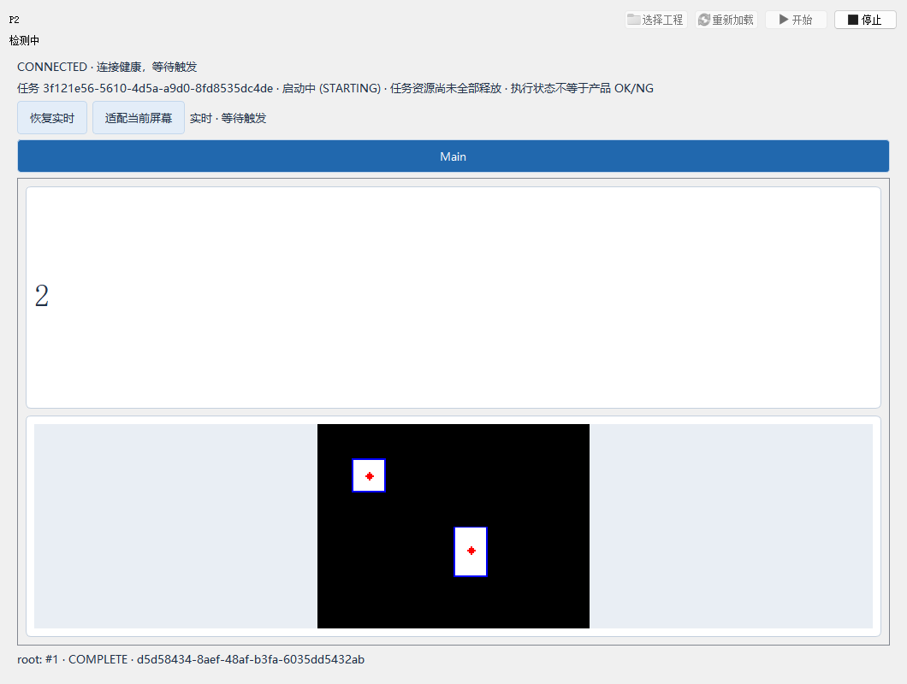

# 独立 Runtime 源码验证

## 范围

本页保留 D1-D3 当时的历史记录。之后的外部打包接入、最终冻结 EXE、工程包与短测结果单独记录在 [冻结与交付验证](runtime-delivery-2026-10-06.md)；本页的 NOT_RUN 表示当时状态，不代表当前仍未实施。

2026-10-06 完成计划 D1-D3 的源码闭环。测试工程是固定的本地图像夹具，识别两块白色区域，部分案例增加数值判定 NG；未使用用户私有工程、相机、PLC 或实际生产模型。

- 工作区：`C:/Users/jsdfhasuh/my_scripts/emo_master`，实目录镜像为 `D:/jsdfhasuh/documents/my_project/emo_master`。
- 参考 HEAD：`9737f04312a2803f824e4bbeab6ea845549edaf7`；验证对象包含本批未提交修改，也包含用户原有 Designer 工作区修改，不是 clean HEAD。
- Python：`C:/Users/jsdfhasuh/.conda/envs/emo_master/python.exe`，3.10 环境。
- 全量 Qt 回归使用 `offscreen`；另使用 `windows` 进行实际 Qt 操作员窗口冒烟并检查截图。
- 测试均使用独立数据目录，结束时停止 worker、显示连接和 Runtime。没有提交、推送、发布或安装。

## 最终相关回归

```powershell
$env:PYTHONPATH = (Join-Path (Get-Location) 'src')
$env:QT_QPA_PLATFORM = 'offscreen'
& "$env:USERPROFILE\.conda\envs\emo_master\python.exe" -m pytest `
  tests/core/test_runtime_directory.py `
  tests/runtime/test_production_continuous.py `
  tests/runtime/test_production_boundaries.py `
  tests/ui/operator_view/test_production_window.py `
  tests/ui/operator_view/test_view.py `
  tests/runtime/test_operator_lifecycle.py `
  tests/runtime/test_worker_heartbeat_finalization.py `
  tests/core/project/test_page_delivery.py `
  tests/core/project/test_delivery_store.py `
  tests/core/project/test_package_builder.py `
  tests/test_windows_package_entry.py `
  tests/test_package_bootstrap.py `
  tests/designer/test_global_counters_dialog.py -q
```

**PASS：109 passed in 58.68s**。其中 36 个新增案例覆盖：

- 2.3 显式迁移、严格配置、Designer 保存保留及 2.1/2.2 默认兼容；旧测试发布器不接受 2.3。
- 声明资源、元数据文件参数（含嵌套/数组与可选空值）、绝对路径、中文/空格目录、不同 CWD 和工程移动后的真实 spawn 输入/输出。
- 输入/工程/Runtime 路径保护、资源缺失或变化、写入失败不兜底；工程设备值与其他参数不被配置脚本重写。
- 同一个 Job/worker 多周期、新 workflowRunId、无旧中间图像或正式输出副本；生命周期一次初始化/释放，普通根调用不变。
- NG 不终止会话；同一关闭结果包含图像、计数与布尔判定；停止等待、停止执行、重新启动和故障后重新加载。
- 释放失败、异常 Start 核对、不重复准入；状态轮询不丢弃操作员点击，重复点击只排一个命令。
- 自动开始、记住工程、加载失败可重新选择、加载中关闭不开始、退出清理及 GUI 响应；源码入口和完整 Runtime 构造不导入 Designer。
- 源码启动脚本可从其他目录运行，`--check` 即使 autoStart=true 也不创建 Job；内部诊断窗口保留单调事件序号与终态，普通持久历史不裁剪。

## 原生 Qt 冒烟

```powershell
$env:QT_QPA_PLATFORM = 'windows'
& "$env:USERPROFILE\.conda\envs\emo_master\python.exe" -m pytest `
  tests/ui/operator_view/test_production_window.py::testOperatorOnlyProjectPagesContinuousAutoStartStopRestartAndClose -q
```

**PASS：1 passed in 10.46s**。启动、页面图像/计数、停止再启和关闭均使用实际 Qt 窗口。已目视检查原生截图，文字和图像可见、主要区域没有重叠；这是合成工程的软件冒烟，不是现场或长期负载验收。离屏截图在本机不能可靠呈现文字，因此没有把离屏像素截图作为原生文字显示证据。



## 全量回归与基线问题

原始 `scripts/ci_check.py` 的 Proto、Ruff、Mypy 通过，但无路径限制的 pytest 同时收集 `manual_test_workspace` 中多份历史代码副本，出现 42 个收集错误和模块路径冲突。没有删除这些目录，也没有修改通用测试配置规避证据。

使用 `PYTEST_ADDOPTS=tests` 明确选择仓库测试后，完整回归结束：

```text
2 failed, 2898 passed, 8 skipped, 28 subtests passed in 796.03s
```

该全量运行发生在最后的文件数组/可选值、旧测试包 schema 保护和状态轮询命令补测之前；随后最终代码执行了上面的 109 项相关回归与静态检查，没有再声称重新完成一轮全量 CI。

| 用例 | 全量结果 | 复核结果与结论 |
| --- | --- | --- |
| testGlobalCountersDialogNewSetAndResetUseBackgroundClient | FAIL，首次记录可见后 createCounter 返回 false | 隔离运行 PASS，最终整个计数器模块 PASS；保留全量时序/顺序风险，未更改计数器代码或弱化断言 |
| testNarrowToolbarKeepsRunActionAndHasOverflow | FAIL，640x500 窗口的 startButton 不可见 | 还原本次 Runtime 接点的隔离副本仍 FAIL，属于本批之前的 Designer 工作区行为；未覆盖用户的 UI 改动 |

隔离副本在 `manual_test_workspace/runtime-production-review-20261006/baseline`：复制当前 src/tests，保留用户原有 Designer 修改，再从上述 HEAD 的 Git archive 还原本批改过的原有 Runtime/项目/Designer 接点。原工作区没有回滚。两项单独执行结果为 **1 passed、1 failed in 3.10s**。

整体 CI 状态仍为 **FAIL**，不是全绿；不能把隔离重跑 PASS 等同于全量时序风险已经消失。

## 静态检查和未验证项

- Proto 漂移检查：PASS。
- Ruff（src、tests 与新增两个入口/配置脚本）：PASS。
- Mypy：PASS，329 source files；仓库默认不检查未标注函数体，不代表完整严格类型覆盖。
- git diff --check：PASS；现有 LF/CRLF 提示不是空白错误。
- `.gitignore` 不再忽略 docs/plans，计划已纳入 Git index；未提交或推送。
- 冻结 EXE、Qt/ONNX/DLL 无源码依赖、冻结 spawn：NOT_RUN；当前 emo_master 环境没有 PyInstaller，本批没有安装构建依赖或改外部打包仓。
- 正式工程包与更新、真实工程/模型性能、相机/PLC、目标负载长测、现场安装和公开发布：NOT_RUN。

现场交付的下一步是 D4 独立冻结产物验证，再根据实际工程补 D5/D6；源码脚本仍需要已有 Python 环境。
