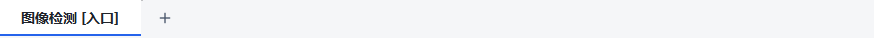

# 工作流“＋”位置回归跟进

起点为 `agent/runtime-workflow-architecture-v1` / `842d87a97efb62ac20364ff248e5a0c4db105831`。
工作区已有一批未提交的页面/工作区改造，本轮只修改原本干净的 `ui/widgets.py`，新增专项测试和本文证据。
其他修改未覆盖、暂存或混入本轮提交。

## 历史与修复

回归来自 `e32a7a75f13ab493bc51a075b15c9c8d68ab0dec`（Git 记录时间 2026-09-10 16:33:51 +08:00）。
该提交把末尾“＋”标签隐藏，改用 TopRightCorner 独立按钮，所以它跟随整行右边界而非最后一个标签。

本轮移除角部布局，按可见标签的自然宽度计算按钮位置，间隔 6 个 Qt 逻辑像素。
标签较多时限制标签条宽度，预留按钮空间；Qt 原有滚动箭头继续使用且不与按钮重叠。
窗口缩放、重命名、添加、移除、清空与 RTL 排列均重新计算，不使用延迟计时器或额外页面模型。
保持 MainWindow 使用的隐藏“＋”索引和新建回调；清空后不发出无效索引，取消新建保持原工作流。
不修改悬浮工具区、流程执行、节点位置、项目格式或 Runtime。

代码提交：`01ffedadb1cbccdeab5ba0a75bf9e9aabcb9d8be`。
[提交内容核对](workflow-tab-plus-2026-10-03/commit-verification.json) 将提交中的全部 617 个 Python 文件
与固定受测副本比较，规范化 CRLF 后全部一致，排除了本轮之外的 dirty 内容。

## 验证

Windows，Python 3.10.21，PySide2 5.15.2.1；不安装依赖、不连接设备。
新测试共 15 例，覆盖单标签/双标签/长标题、LTR/RTL、180/320/520 宽度溢出、标签滚动切换、
重命名/移除/清空及真实 MainWindow 新建/取消。

| 检查 | 实际结果 |
| --- | --- |
| 修复前最初 12 个专项 | 7 FAIL、5 PASS，2.25 秒；[原始日志](workflow-tab-plus-2026-10-03/baseline-result.txt) |
| 首次候选：只预留空间，未限制自然宽度 | 7 FAIL、5 PASS；[原始日志](workflow-tab-plus-2026-10-03/candidate-01-result.txt) |
| 按自然宽度计算后 | 12 PASS；[日志](workflow-tab-plus-2026-10-03/candidate-02-result.txt) |
| 增补 RTL 溢出后的原生 Qt 专项及受影响回归 | **83 PASS，11.15 秒**；[日志](workflow-tab-plus-2026-10-03/regression-windows-result.txt) |
| detached 起点副本，仅叠加本轮两个代码/测试文件 | **65 PASS，6.96 秒**；[日志](workflow-tab-plus-2026-10-03/isolated-regression-result.txt) |
| Ruff / mypy | PASS；mypy 检查 1 个源文件 |
| 原生 100%、125%、150%、200% 缩放捕获 | PASS；单标签、双标签和 RTL 在四种缩放下均保持 6 个逻辑像素间距，溢出时按钮位于可见标签条末端 |
| 完整 CI | **NOT_RUN，本轮未重跑全套 CI** |

各次原始日志对应的 provenance.json 记录真实 HEAD、dirty、逐文件源码摘要、命令与耗时；
检查运行过程中源码均未改变。83 与 65 属于两个不同受测状态，不相加为独立用例总数。

新测试最初导入 Qt 后再加载项目，曾出现 ONNX DLL 的原生异常输出；随后按仓库已有约定在测试中
先 import emo_master，再导入 Qt。上表基线是在正确预加载顺序下重跑，未修改生产 DLL 处理或依赖。
原 A18、Qt 间歇崩溃、资源稳态及运行页面性能记录不因本轮专项通过而改判。

复现专项：

```powershell
$env:QT_QPA_PLATFORM = 'windows'
$env:PYTHONUTF8 = '1'
Remove-Item Env:PYTHONIOENCODING -ErrorAction SilentlyContinue
Remove-Item Env:QT_SCALE_FACTOR -ErrorAction SilentlyContinue
& 'C:/Users/jsdfhasuh/.conda/envs/emo_master/python.exe' -m pytest tests/designer/test_workflow_tab_add_button.py tests/designer/test_main_window_workflow_tabs.py tests/designer/test_main_window_project_save_load.py tests/designer/test_startup_project_entry.py tests/designer/test_visual_layout.py tests/designer/test_app_qss.py -q
```

## 实际截图

下图来自源码 MainWindow 与受控 Client，没有 Runtime 或 Job。单独标签栏在 1000 逻辑像素宽度下，
单标签间距由 822 变为 6，双标签由 681 变为 6；RTL 由 684 变为 6。
标签溢出时最后一个逻辑标签可能位于屏幕外，此时按钮保持在可见条末端，不追随屏幕外的标签。

修改前：


修改后：



四组原生缩放测量与截图均保留在 [证据目录](workflow-tab-plus-2026-10-03/)，
[清单](workflow-tab-plus-2026-10-03/manifest.json) 记录文件摘要。
缩放通过 QT_SCALE_FACTOR 在同一台 Windows 桌面执行，不代表四台物理显示器或现场验收。

可重新捕获截图（输出目录必须不存在）：

```powershell
$env:QT_QPA_PLATFORM = 'windows'
$env:QT_SCALE_FACTOR = '2'
& 'C:/Users/jsdfhasuh/.conda/envs/emo_master/python.exe' docs/testing/workflow-tab-plus-2026-10-03/capture.py manual_test_workspace/plus-capture-new
```

本轮可独立提交这处位置修复；未提交的工作区改造与动画双按钮仍留在原工作区。
