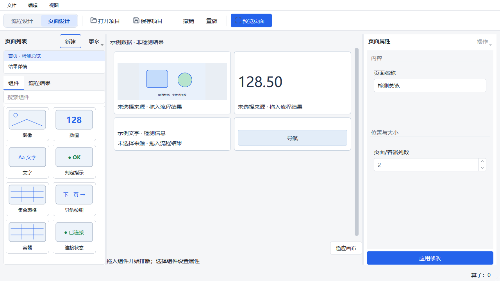

# 工作区切换：双按钮与滑动动画

基于本地 `842d87a97efb62ac20364ff248e5a0c4db105831` 及已有未提交的工作区界面改造继续修改。
本轮只修改该改造中的 `page_designer/chrome.py`，新增 `workspace_switch.py` 与相应测试。
原有其他修改保留；本轮没有把尚未提交的整批界面改造混合提交或推送。

## 行为

- “流程设计”和“页面设计”常驻工具栏，单击即可选择，不再展开工作区下拉菜单。
- 原生 QToolButton 复用现有 QAction；选中背景通过一个 180 ms OutCubic 动画滑动。
  快速反向切换从当前视觉位置继续；重复刷新不会重新开始动画。
- 以 Coordinator 实际接受的工作区为准，保留待提交表单校验及首次启用页面格式的确认。
  拒绝启用或表单无效时，按钮与滑块仍指向原工作区。
- Tab/空格键可操作，禁用状态继承原动作。隐藏时停止动画并归位，销毁时由 Qt 释放动画所有权。
- 不新增运行任务、订阅、结果读取、项目配置或撤销记录；不改 Runtime 行为。

## 本轮验证

Windows，Python 3.10.21，PySide2 5.15.2.1。记录对应 dirty 工作区，不能只用 HEAD 代表受测代码。

| 检查 | 结果 |
| --- | --- |
| 修改前工作区与已有运行查看专项 | 28 PASS |
| 修改后初次专项（offscreen） | 34 PASS |
| 最终专项与相关回归（原生 Windows Qt） | **57 PASS，16.56 秒** |
| Ruff（新增控件、接入文件、测试） | PASS |
| mypy（两个控件源文件） | PASS |
| 1600×900、100% 原生窗口约束 | PASS，实际客户区 1598×820 |
| 1280×720、200% 原生窗口约束 | PASS，实际客户区 638×319 |
| 动画连续捕获 | PASS，10 帧记录实际时钟及滑块位置；两按钮各 92 逻辑像素且完整可见 |
| 完整 CI | **NOT_RUN，本轮未重复全套 CI**；不沿用上一批的 CI 结果冒充本轮结果 |

新增 7 个测试覆盖动画中间状态、重复刷新、反向切换、隐藏/销毁、鼠标与键盘、禁用按钮、
无效输入以及首次页面启用被拒绝。相关回归包括项目保存、用户路径与主窗口布局。

复现专项：

```powershell
$env:QT_QPA_PLATFORM = 'windows'
$env:PYTHONUTF8 = '1'
Remove-Item Env:QT_SCALE_FACTOR -ErrorAction SilentlyContinue
Remove-Item Env:PYTHONIOENCODING -ErrorAction SilentlyContinue
& 'C:/Users/jsdfhasuh/.conda/envs/emo_master/python.exe' -m pytest tests/ui/page_designer/test_workspace_switch.py tests/ui/page_designer/test_workspace_modes.py tests/ui/page_designer/test_current_job_viewing.py tests/ui/page_designer/test_user_path.py tests/designer/test_visual_layout.py -q
```

[原生专项日志](workspace-switch-2026-10-03/check-0.txt)、[静态检查](workspace-switch-2026-10-03/check-1.txt)、
[类型检查](workspace-switch-2026-10-03/check-2.txt)、[受测源码摘要](workspace-switch-2026-10-03/checks.json)
与 [证据清单](workspace-switch-2026-10-03/manifest.json) 已保留。源码在检查过程中未变。

两组窗口验证使用现有 `scripts/validate_designer_workspaces.py --physical-screen`，只约束当前
Windows 桌面上的窗口空间，没有改变系统分辨率，不等同于多台物理显示器验收。
尺寸与检查见 [200%](workspace-switch-2026-10-03/geometry-1280-200.json) 和
[100%](workspace-switch-2026-10-03/geometry-1600-100.json)。

截图辅助程序最初调用了本机 PySide2 不提供的 QTest.qWait，改用 Qt 事件循环后重新捕获成功。
可选 GIF 导出因当前解释器没有 Pillow 未执行，未安装依赖；保留连续原生 PNG 帧及
[实际动画测量](workspace-switch-2026-10-03/measurements.json)，该限制不影响控件自身动画。




本轮不改判原 A18、Qt 间歇崩溃、资源稳态及运行页面性能记录，也不涉及冻结包、设备或现场发布。
