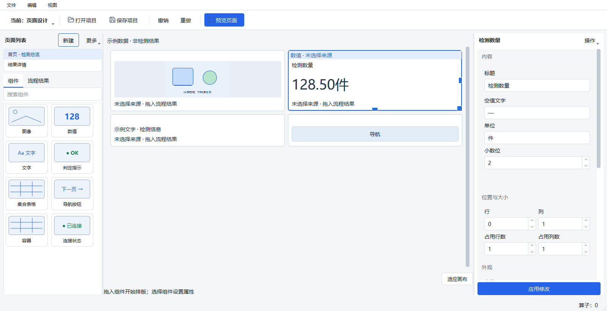
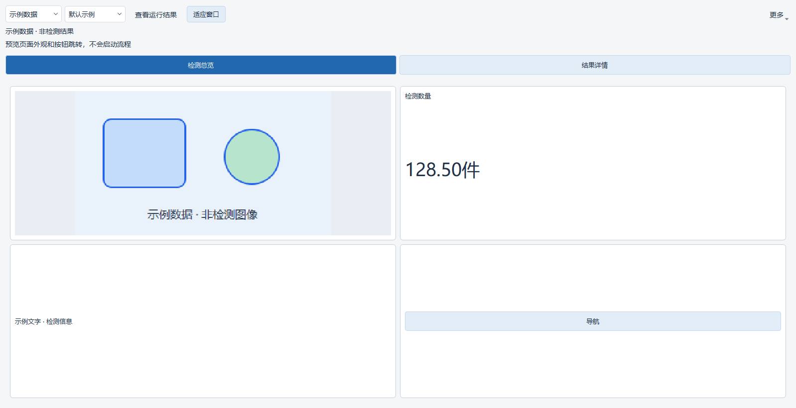

# 主界面与页面设计器工作区改造验收

本次在当前工作区实现统一工具栏、流程/页面互斥、三栏页面编辑、独立预览与图片测试/结果查看生命周期拆分。基于 `842d87a97efb62ac20364ff248e5a0c4db105831` 继续修改；保留已有拖放、尺寸测量和组件缩略图修改。此报告验证源码 UI 与客户端行为，不包含安装包发布或真实设备现场验收。

## 已实现的用户路径

1. 打开项目默认进入流程设计，顶部“当前：流程设计 ▾”切换工作区。文件操作、项目撤销/重做共用动作；运行菜单、流程操作和删除快捷键在页面设计中隐藏并禁用。
2. 页面设计左上管理展示页面，下方是组件/流程结果；编辑画布没有重复的页面按钮。右侧属性按内容、位置与大小、外观、数据来源分组，标题与“应用修改”固定。
3. 流程设计通过“图片测试 → 选择测试图片”关联明确的图片输入节点，再通过“开始测试/停止测试”控制自有测试。底部显示测试状态及失败原因。沿用现有资源登记与受支持算子限制。
4. 页面设计点击“预览页面”打开独立窗口，首次使用明确标识的示例数据。窗口复用；切回流程设计时隐藏，返回后需主动再次打开。
5. 预览选择“运行结果”时查询当前项目已有运行记录，不创建任务。高级地址/运行编号藏在“更多 → 高级连接…”。停止查看、关闭窗口、切回示例只释放查看连接，不停止正常运行或图片测试。
6. 固定结果时同时保留当时页面配置。新配置延后到“继续更新”；中途撤销回原配置会清除旧的待更新配置。关闭窗口会取消尚未执行的示例/重连回调；项目关闭能将正在进行的查看清理升级为完整自有任务收尾。

无效属性保留原文、定位输入并阻止切换。用户看到简短中文提示，原始模型诊断保留在日志与悬停信息中。未运行、等待结果、未选择来源、未采集所需数据和断线分别显示，真实结果缺失时不会自动填入示例值。

## 实现边界

- `chrome.py` 集中组织工具栏、菜单、快捷键和可用状态；Qt 动作回调显式检查启用状态，防止程序触发已禁用动作。
- `coordinator.py` 维护唯一活动工作区，统一提交待应用输入与项目历史；隐藏工作区的尺寸约束不会强制撑大当前窗口。
- `preview.py` 分开管理图片测试所有权与查看连接，`preview_window.py` 提供独立预览。复用现有执行、展示服务和结果身份规则。
- `workspace.py`、`tools.py`、`property_panel.py` 负责页面布局、属性和可读提示；宽度不足时通过“视图”切换侧栏，不缩小字体。
- 编辑画布预留垂直滚动条宽度，尺寸测量遵守固定滚动条策略，避免嵌套组件变高时出现 14 像素的拖拽预览/落点差异。原先容器边框、标题和未应用属性的测量修复保留。
- 没有修改项目模型、RPC 协议、组件类型、执行调度或设备支持范围；已有页面名、组件名不自动重写。

## 行为检查

环境：Windows、Conda `emo_master`、Python 3.10 / PySide2。自动化使用临时项目与数据目录；图片测试使用本地图片和现有执行服务，不连接真实设备。

| 检查 | 结果 |
|---|---|
| 开始改造前的页面设计与主窗口针对性基线 | 146 passed |
| 结束阶段尺寸、未应用属性、两次运行观察、页面布局及工作区边界 | 51 passed in 19.49s |
| 固定结果配置/撤销、查看窗口/任务分离、无隐式执行、无效输入等专项 | 45 passed in 13.87s |
| 原生资源生命周期单独复测 | 16 passed in 16.44s |
| 最终 `scripts/ci_check.py` | PASS：proto-drift、Ruff、mypy（297 个源文件）；pytest **2616 passed, 8 skipped, 26 subtests passed in 681.74s** |
| `git diff --check` | PASS |

关键回归覆盖：互斥动作与快捷键、反复切换、当前选择、复制/首页/页面导航、数据来源拖放、尺寸调整、项目撤销/重做与保存重开、同名图片输入节点选择、首次示例预览、单窗口复用、隐藏/恢复/关闭、固定结果配置一致性、连接中关闭、失败中关闭、查看清理升级为项目关闭，以及“图片测试 → 编辑 → 查看结果 → 关闭预览”的真实客户端路径。

完整检查的复现命令：

```powershell
Remove-Item Env:PYTHONIOENCODING -ErrorAction SilentlyContinue
$env:PYTHONUTF8 = '1'
$env:PYTEST_ADDOPTS = '--ignore=manual_test_workspace'
python scripts/ci_check.py
```

这里只排除工作区内 `manual_test_workspace` 中冻结的历史测试副本；正式 `tests/` 全部参与，协议检查、Ruff 与 mypy 保持原脚本执行。直接无排除运行会收集这些历史副本并发生导入冲突。一次中途验证仅设置 `PYTHONIOENCODING=utf-8`，造成子进程输出与父进程 GBK 解码不一致；改用 `PYTHONUTF8=1` 后启动目录锁专项通过，不修改产品行为或降低断言。

首轮完整检查曾在原生线程身份检查中失败；独立复测和最终整套检查均通过，未放宽原断言。迁移中出现的旧文案/旧工具栏断言、布局切换及尺寸偏差均作为本轮问题修正，不计为“已有失败”。最终正式测试无失败，8 项跳过保留原测试条件。

原始结果：[完整检查日志](workspace-ui-2026-10-03/ci-check.txt)、[生命周期独立复测](workspace-ui-2026-10-03/lifecycle-isolated.txt)。[候选文件摘要](workspace-ui-2026-10-03/candidate.json) 记录本轮检查涉及的工作区源文件/测试/脚本；[证据清单](workspace-ui-2026-10-03/manifest.json) 保存全部截图、尺寸与日志 SHA-256。

## 原生窗口与缩放验收

使用 `scripts/validate_designer_workspaces.py --physical-screen`，分别启动 12 个原生 Windows Qt 进程。尺寸参数代表物理屏幕像素，脚本按 DPR，并扣除当前任务栏与原生窗口边框后计算目标客户区；没有改变操作系统实际分辨率。当前物理桌面为 1920×1080，结果属于同一桌面上按目标可用空间约束的窗口验收，不是四台显示器的现场验收。

| 目标屏幕 | 100% 客户区 | 125% 客户区 | 150% 客户区 | 200% 客户区 |
|---|---|---|---|---|
| 1280×720 | 1278×640 | 1022×512 | 851×426 | 638×319 |
| 1600×900 | 1598×820 | 1278×656 | 1065×546 | 798×409 |
| 1920×1080 | 1918×1000 | 1534×800 | 1278×666 | 958×499 |

每组输出 `flow.png`、`empty.png`、`pages.png`、`preview.png`、`many-pages.png`、`preview-many-pages.png`、`invalid-property.png`；窄窗口另有 `compact-library.png`。`geometry.json` 保存请求/实际尺寸、DPR、分栏宽度、控件可达性、无效输入阻止切换、HEAD、工作区状态和源码 SHA-256。源文件摘要对应截图实际捕获时的文件，不能只按 HEAD 将未提交修改误认作该提交内容。

检查项：主窗口/预览不超出目标客户区，流程运行按钮、工作区入口、预览按钮与固定“应用修改”可达；属性不产生横向滚动；多页列表收紧并滚动；独立预览多页横向滚动；长标题省略并保留完整提示；非法字号定位、文字保留和切换阻止；切回流程后预览隐藏。

复现示例（输出目录必须不存在）：

```powershell
$env:QT_QPA_PLATFORM = 'windows'
$env:QT_SCALE_FACTOR = '2'
python scripts/validate_designer_workspaces.py --output manual_test_workspace/workspace-1280-200-new --width 1280 --height 720 --physical-screen
```

### 页面设计：1600×900，100%



### 独立预览



### 1280×720，200%：无效输入与固定应用区


完整尺寸与截图目录：[本轮证据](workspace-ui-2026-10-03/)。截图验证布局，不替代行为、资源所有权、真实设备或发布验收。
